# BÁO CÁO YÊU CẦU KINH DOANH VÀ KỸ THUẬT (BRD & TRD)
## DỰ ÁN: POBBY - HỆ THỐNG THƯƠNG MẠI ĐIỆN TỬ ĐA NGƯỜI BÁN (B2B2C)

---

**Phiên bản:** 2.0  
**Ngày tạo:** 16/09/2026  
**Tác giả:** Đội ngũ phân tích hệ thống  
**Trạng thái:** DRAFT - Đang hoàn thiện  
**Phân loại:** Tài liệu nội bộ - Bí mật

---

# PHẦN 1: BUSINESS REQUIREMENTS DOCUMENT (BRD)

## 1.1 Tóm tắt tổng quan (Executive Summary)

### 1.1.1 Bối cảnh dự án
**Pobby** là nền tảng thương mại điện tử đa người bán (Multi-vendor Marketplace) mô hình **B2B2C** (Business-to-Business-to-Consumer), được phát triển để giải quyết bài toán chuyển đổi số cho các doanh nghiệp bán lẻ thời trang, phụ kiện và đồng hồ tại Việt Nam. Hệ thống cho phép nhiều người bán (Seller) mở gian hàng trực tuyến trên cùng một nền tảng, trong khi quản trị viên (Admin) giám sát toàn bộ hoạt động kinh doanh.

### 1.1.2 Vấn đề cần giải quyết
Hiện tại, các doanh nghiệp nhỏ và vừa (SMEs) tại Việt Nam gặp phải các thách thức:
- **Chi phí triển khai cao**: Xây dựng website bán hàng riêng tốn kém về infrastructure, development, maintenance
- **Khó khăn trong quản trị đa kênh**: Không có hệ thống tập trung quản lý đơn hàng, tồn kho, khách hàng từ nhiều nguồn
- **Thiếu công cụ phân tích**: Không thể theo dõi doanh thu, hành vi khách hàng, hiệu quả marketing real-time
- **Rào cản kỹ thuật**: Không có đội ngũ IT nội bộ để vận hành hệ thống phức tạp

### 1.1.3 Giải pháp đề xuất
Xây dựng nền tảng **Pobby** với 3 giao diện chính:
| Giao diện | Đối tượng | Chức năng cốt lõi |
|-----------|-----------|-------------------|
| **Customer Frontend** | Khách hàng cuối (B2C) | Duyệt sản phẩm, giỏ hàng, thanh toán, theo dõi đơn, quản lý tài khoản |
| **Seller Portal** | Người bán (Seller) | Quản lý gian hàng, sản phẩm, đơn hàng, doanh thu, rút tiền, phân tích |
| **Admin Panel** | Quản trị viên (Admin) | Quản trị toàn hệ thống: user, seller, category, product, order, revenue, config, audit |

### 1.1.4 Giá trị cốt lõi (Value Proposition)
- **Time-to-market**: Seller có thể mở gian hàng trong 15 phút thay vì 2-3 tháng tự xây dựng
- **Chi phí thấp**: Mô hình SaaS, chia sẻ infrastructure, trả theo sử dụng
- **Quản trị tập trung**: Admin có visibility 360° toàn bộ ecosystem
- **Mở rộng dễ dàng**: Kiến trúc microservices-ready, API-first design

---

## 1.2 Mục tiêu dự án (Project Objectives - SMART)

| Mã | Mục tiêu | Chỉ số đo lường (KPI) | Thời hạn | Trạng thái |
|----|----------|----------------------|----------|------------|
| **OBJ-01** | Triển khai MVP hoàn chỉnh 3 giao diện | 100% test cases passed, 0 critical bugs | Tuần 1-10 | 🟡 In Progress |
| **OBJ-02** | Onboard 50+ Seller trong 3 tháng đầu | ≥ 50 Seller active, ≥ 500 sản phẩm | Tuần 11-22 | ⏳ Planned |
| **OBJ-03** | Xử lý 1,000+ đơn hàng/tháng | Throughput ≥ 1,000 orders/month, SLA < 2h | Tuần 11-22 | ⏳ Planned |
| **OBJ-04** | Đạt 99.5% uptime | Availability ≥ 99.5%, MTTR < 30 phút | Tuần 1-52 | ⏳ Planned |
| **OBJ-05** | Thời gian tải trang < 2s | P95 < 2s, P99 < 3s (Core Web Vitals) | Tuần 1-10 | 🟡 In Progress |
| **OBJ-06** | Tỷ lệ chuyển đổi ≥ 3% | Conversion rate ≥ 3% (visit → order) | Tuần 11-22 | ⏳ Planned |
| **OBJ-07** | Hỗ trợ 10,000 concurrent users | Load test passed 10k VU, error rate < 0.1% | Tuần 23-34 | ⏳ Planned |
| **OBJ-08** | Tích hợp 3 cổng thanh toán VN | Momo, VNPay, Bank Transfer operational | Tuần 11-18 | ⏳ Planned |

### 1.2.1 Mục tiêu kinh doanh (Business Goals)
- **Doanh thu**: Đạt 5 tỷ VNĐ GMV (Gross Merchandise Value) năm đầu tiên
- **Market share**: Top 5 marketplace chuyên ngành thời trang/phụ kiện tại Việt Nam
- **Retention**: Seller retention rate ≥ 80% sau 6 tháng, Customer repeat rate ≥ 35%

### 1.2.2 Mục tiêu kỹ thuật (Technical Goals)
- **API Response Time**: P95 < 200ms cho 95% endpoints
- **Database Performance**: Query P95 < 100ms, Connection pool utilization < 70%
- **Security**: Zero critical vulnerabilities (OWASP Top 10), SOC 2 Type II ready
- **Scalability**: Horizontal scaling support, stateless services

---

## 1.3 Phạm vi dự án (Project Scope)

### 1.3.1 Trong phạm vi (In-Scope) - Phase 1 (MVP - 10 tuần)

#### A. Customer Frontend (8 Modules)
| Module | Mô tả | Priority |
|--------|-------|----------|
| **BR01 - Home & Discovery** | Trang chủ, banner, flash sale, sản phẩm nổi bật, danh mục | Must Have |
| **BR02 - Product Listing** | Danh sách sản phẩm, filter (giá, danh mục, seller), search, pagination | Must Have |
| **BR03 - Product Detail** | Chi tiết SP: gallery, specs, related products, thêm vào giỏ | Must Have |
| **BR04 - Shopping Cart** | Slide-out cart, cập nhật SL, voucher, shipping estimate, checkout CTA | Must Have |
| **BR05 - Checkout & Payment** | Địa chỉ giao hàng, phương thức thanh toán (COD, Bank, Momo, VNPay), xác nhận | Must Have |
| **BR06 - Order Tracking** | Lịch sử đơn hàng, chi tiết, trạng thái real-time, hủy đơn, mua lại | Must Have |
| **BR07 - Authentication** | Đăng ký/đăng nhập (email, phone, social), quên mật khẩu, OTP, JWT | Must Have |
| **BR08 - User Profile & Wishlist** | Thông tin cá nhân, địa chỉ, avatar, đổi mật khẩu, preferences, yêu thích sản phẩm | Must Have |

#### B. Seller Portal (5 Modules)
| Module | Mô tả | Priority |
|--------|-------|----------|
| **BR10 - Store Setup** | Đăng ký gian hàng, hồ sơ doanh nghiệp, xác thực (KYC), cấu hình shop | Must Have |
| **BR10P - Product Management** | CRUD sản phẩm, variant (size/color), inventory, bulk import/export, SEO | Must Have |
| **BR12 - Order Management** | Xem đơn, xác nhận, đóng gói, in đơn vận đơn, cập nhật trạng thái, hoàn trả | Must Have |
| **BR13 - Revenue & Payout** | Dashboard doanh thu, chi tiết giao dịch, yêu cầu rút tiền, lịch sử payout | Must Have |
| **BR14 - Analytics** | Báo cáo bán hàng, khách hàng, sản phẩm bán chậm, conversion funnel | Should Have |

#### C. Admin Panel (10 Modules)
| Module | Mô tả | Priority |
|--------|-------|----------|
| **BR15 - Dashboard** | Real-time KPI: GMV, Orders, Users, Sellers, Conversion, Revenue chart | Must Have |
| **BR16 - User Management** | CRUD user, role assignment, status (active/ban), impersonate, audit log | Must Have |
| **BR17 - Seller Management** | Duyệt/từ chối đăng ký, quản lý hồ sơ, commission config, penalty, payout approve | Must Have |
| **BR18 - Category Management** | CRUD category tree, attribute definitions, display order, SEO | Must Have |
| **BR19 - Product Moderation** | Duyệt/ẩn sản phẩm, spam detection, brand protection, bulk actions | Must Have |
| **BR20 - Order Management** | Xem toàn bộ đơn, lọc nâng cao, force update status, dispute resolution | Must Have |
| **BR21 - Revenue & Commission** | Báo cáo doanh thu theo seller/category/time, commission calc, invoice gen | Must Have |
| **BR22 - System Configuration** | Site settings, shipping rules, payment gateway config, email/SMS template | Must Have |
| **BR23 - Role & Permission** | RBAC: Role CRUD, permission matrix, resource-level access control | Must Have |
| **BR24 - Audit & Logs** | Activity log, login history, API access log, error tracking, export | Should Have |

### 1.3.2 Ngoài phạm vi (Out-of-Scope) - Phase 1

| Loại | Chi tiết | Lý do | Dự kiến Phase |
|------|----------|-------|---------------|
| **Mobile App** | iOS/Android native app | Resource constraint | Phase 2 |
| **Multi-language** | English, Chinese support | Chỉ tập trung VN market | Phase 2 |
| **Advanced Marketing** | Coupon engine, loyalty points, affiliate, flash sale scheduler | Complexity | Phase 2 |
| **Logistics Integration** | GHN, GHTK, J&T API auto-create shipping label | Vendor negotiation needed | Phase 2 |
| **AI/ML Features** | Recommendation engine, fraud detection, demand forecasting | Data volume insufficient | Phase 3 |
| **Multi-currency** | USD, EUR support | Chỉ VNĐ phase 1 | Phase 3 |
| **B2B Wholesale** | Bulk ordering, tiered pricing, quote management | Different business model | Phase 3 |
| **Live Streaming Sales** | TikTok Shop style live commerce | Infrastructure heavy | Phase 3 |

---

## 1.4 Danh sách bên liên quan (Stakeholders)

| Tên Stakeholder | Chức danh / Vai trò | Vai trò trong dự án | Mức độ ảnh hưởng | Mong đợi chính |
|-----------------|---------------------|---------------------|------------------|----------------|
| **Nguyễn Văn A** | CEO / Product Owner | **Approve** - Chốt scope, budget, timeline | Cao | ROI > 200%, time-to-market nhanh |
| **Trần Thị B** | CTO / Technical Lead | **Approve/Review** - Kiến trúc, tech stack, security | Cao | Scalable, maintainable, secure |
| **Lê Văn C** | Project Manager | **Create/Maintain** - Planning, tracking, risk mgmt | Cao | On-time, on-budget, quality |
| **Phạm Thị D** | Business Analyst | **Create** - BRD, SRS, Use cases, UAT scenarios | Trung bình | Requirements complete, traceable |
| **Hoàng Văn E** | Backend Lead (Python/Flask) | **Create** - API, DB, Business logic, Integration | Cao | Clean code, performance, testable |
| **Võ Thị F** | Frontend Lead (JS/CSS) | **Create** - SPA, UI/UX, Responsive, Accessibility | Cao | Modern UX, cross-browser, fast |
| **Đặng Văn G** | Database Admin | **Review/Maintain** - Schema, Index, Backup, Performance | Trung bình | Data integrity, HA, recovery |
| **Bùi Thị H** | QA Lead | **Review** - Test plan, Test cases, Automation, Bug triage | Trung bình | Zero critical bugs, coverage > 80% |
| **Ngô Văn I** | DevOps Engineer | **Create/Maintain** - CI/CD, Docker, K8s, Monitoring, Infra | Trung bình | Automated deploy, observability |
| **Seller Representatives** | Người bán đại diện | **Review** - UAT, Feedback, Feature request | Trung bình | Easy to use, fair commission, fast payout |
| **Customer Focus Group** | Khách hàng mẫu | **Review** - Usability testing, Feedback | Thấp | Smooth UX, fast checkout, trust |
| **Legal/Compliance** | Pháp lý, Tuân thủ | **Approve** - Data privacy, Terms, Payment regulations | Cao | GDPR/PDPA compliant, legal safe |

---

## 1.5 Phân tích SWOT (SWOT Analysis)

### 1.5.1 Điểm mạnh (Strengths - Internal Positive)

| Mã | Yếu tố mạnh | Mô tả chi tiết | Tác động |
|----|-------------|----------------|----------|
| **S-01** | **Kiến trúc hiện đại, tách biệt rõ ràng** | 3-layer architecture (Model-DAO-BUS) + REST API, dễ maintain, test, scale | Cao |
| **S-02** | **Tech stack phổ biến, dễ tuyển dụng** | Python/Flask, SQL Server, Vanilla JS - talent pool lớn tại VN | Cao |
| **S-03** | **Database design chuẩn hóa** | ERD rõ ràng, FK constraints, indexes, stored proc cho báo cáo phức tạp | Cao |
| **S-04** | **RBAC linh hoạt** | Role-based access control cấp resource-level, hỗ trợ multi-tenant seller | Trung bình |
| **S-05** | **API-first design** | Tất cả chức năng expose qua REST API, sẵn sàng cho mobile app, 3rd party integration | Cao |
| **S-06** | **Session management an toàn** | JWT + Refresh token, HttpOnly cookies, CSRF protection, rate limiting | Cao |
| **S-07** | **Codebase có cấu trúc** | Separation of concerns, naming convention nhất quán, type hints | Trung bình |
| **S-08** | **Hỗ trợ multi-seller native** | Database schema thiết kế cho multi-vendor từ đầu, không cần refactor lớn | Cao |

### 1.5.2 Điểm yếu (Weaknesses - Internal Negative)

| Mã | Yếu tố yếu | Mô tả chi tiết | Mức độ | Kế hoạch khắc phục |
|----|------------|----------------|--------|-------------------|
| **W-01** | **Monolithic deployment** | Flask app single process, khó scale horizontal, single point of failure | Cao | Containerize + K8s, split services Phase 2 |
| **W-02** | **No caching layer** | Truy vấn DB trực tiếp cho mọi request, chậm khi traffic cao | Cao | Redis cho session, product catalog, rate limiting |
| **W-03** | **Frontend vanilla JS** | Không có framework (React/Vue), khó maintain UI phức tạp, state management manual | Trung bình | Migration plan sang React/Next.js Phase 2 |
| **W-04** | **Thiếu automated testing** | Chỉ manual test, không có unit/integration/E2E test pipeline | Cao | Setup pytest + Playwright, CI gate |
| **W-05** | **No observability** | Chỉ print log, không có metrics, tracing, alerting | Cao | OpenTelemetry + Prometheus + Grafana |
| **W-06** | **SQL Server single instance** | Không HA, không read replica, backup manual | Cao | AlwaysOn AG, read replica, automated backup |
| **W-07** | **Hardcoded config** | Connection string, secrets trong code, không dùng env vault | Trung bình | Azure Key Vault / HashiCorp Vault |
| **W-08** | **Limited payment integration** | Chỉ COD + Bank transfer manual, chưa có Momo/VNPay/Stripe | Cao | Priority integration Sprint 3-4 |
| **W-09** | **No email/SMS service** | Chỉ log console, không có notification thực tế | Trung bình | Integrate SendGrid/Twilio/Infobip |
| **W-10** | **Technical debt** | Một số stored proc phức tạp, business logic lẫn trong DAO | Trung bình | Refactor dần, domain-driven design |

### 1.5.3 Cơ hội (Opportunities - External Positive)

| Mã | Cơ hội | Mô tả | Tiềm năng | Timeline |
|----|--------|-------|-----------|----------|
| **O-01** | **Tăng trưởng e-commerce VN 25%/năm** | Thị trường 23 tỷ USD 2025, dự báo 39 tỷ USD 2028 | Rất cao | Ongoing |
| **O-02** | **Chuyển đổi số SMEs pós-COVID** | 70% SMEs chưa có nền tảng online chuyên nghiệp | Cao | Phase 1-2 |
| **O-03** | **Chính sách hỗ trợ DT số chính phủ** | Chương trình "Quốc gia số", hỗ trợ vốn, đào tạo | Trung bình | 2024-2026 |
| **O-04** | **Mở rộng sang cross-border** | Xuất khẩu sang Campuchia, Lào, Myanmar qua platform | Trung bình | Phase 3 |
| **O-05** | **AI/ML cho personalization** | Recommendation, dynamic pricing, fraud detection | Cao | Phase 3 (cần data volume) |
| **O-06** | **Partnership logistics/finance** | Revenue sharing với GHN, Momo, ngân hàng | Cao | Phase 2 |
| **O-07** | **White-label solution** | Bán lại platform cho các tập đoàn lớn muốn tự vận hành | Trung bình | Phase 3 |
| **O-08** | **Marketplace niche vertical** | Chuyên ngành: đồng hồ, thời trang, mỹ phẩm, đồ gia dụng | Cao | Current focus |

### 1.5.4 Thách thức (Threats - External Negative)

| Mã | Thách thức | Mô tả | Mức độ rủi ro | Mitigation |
|----|------------|-------|---------------|------------|
| **T-01** | **Cạnh tranh sàn lớn (Shopee, Lazada, TikTok Shop)** | Market share lớn, marketing budget khủng, logistics riêng | Rất cao | Focus niche, specialized UX, lower commission |
| **T-02** | **Thay đổi quy định pháp lý** | Luật Bảo vệ dữ liệu cá nhân (PDPA), Luật Thương mại điện tử 2023 | Cao | Legal review quarterly, compliance by design |
| **T-03** | **Tấn công bảo mật (DDoS, SQLi, XSS, Account takeover)** | E-commerce là target số 1 cho hacker | Rất cao | WAF, pen-test định kỳ, bug bounty |
| **T-04** | **Thay đổi thuật toán ads (Facebook, Google, TikTok)** | CPA tăng, organic reach giảm, phụ thuộc paid marketing | Cao | Multi-channel, SEO, referral, brand building |
| **T-05** | **Khủng hoảng logistics/last-mile** | Ship chậm, mất hàng, chi phí tăng, SLA không đảm bảo | Trung bình | Multi-carrier, SLA monitoring, insurance |
| **T-06** | **Inflation, tỷ giá, Kaufkraft giảm** | Khách hàng thắt chặt chi tiêu, giảm đơn giá trung bình | Trung bình | Promo engine, installment, value messaging |
| **T-07** | **Key person dependency** | Team nhỏ, bus factor thấp cho core modules | Cao | Documentation, cross-training, code review |
| **T-08** | **Technical obsolescence** | Python 3.12+, Flask 3.x, SQL Server 2022 migration needed | Trung bình | Tech radar, upgrade sprint hàng quý |

---

## 1.6 Phân tích Tài chính & Kế hoạch (Financial Analysis & Timeline)

### 1.6.1 Phân tích Chi phí - Lợi ích (Cost-Benefit Analysis)

#### Chi phí đầu tư (CAPEX - Capital Expenditure)

| hạng mục | Chi tiết | Ước tính (VNĐ) | Ghi chú |
|----------|----------|----------------|---------|
| **Development Team** | 5 devs × 10 weeks × 25M/tháng | 312,500,000 | 2 BE, 1 FE, 1 QA, 1 DevOps |
| **Infrastructure Setup** | Server, DB, Domain, SSL, CI/CD | 50,000,000 | AWS/Azure free tier + reserved |
| **Design & UX** | UI/UX design, prototype, usability test | 80,000,000 | Freelance/Agency |
| **Security & Compliance** | Pen-test, SSL EV, Legal review | 60,000,000 | 3rd party audit |
| **Third-party Integrations** | Payment gateway setup, SMS/Email API | 30,000,000 | Momo, VNPay, SendGrid |
| **Contingency (15%)** | Dự phòng rủi ro | 80,000,000 | Best practice |
| **TỔNG CAPEX** | | **612,500,000** | ~612.5 triệu VNĐ |

#### Chi phí vận hành (OPEX - Operational Expenditure) - Hàng tháng

| hạng mục | Chi tiết | Ước tính/tháng (VNĐ) | Ghi chú |
|----------|----------|---------------------|---------|
| **Cloud Infrastructure** | App Service, SQL DB, Redis, CDN, Storage | 25,000,000 | Scale với traffic |
| **Monitoring & Logging** | Datadog/NewRelic/Grafana Cloud | 10,000,000 | Per host/metric |
| **Email/SMS/Push** | SendGrid, Twilio, Firebase | 8,000,000 | Volume-based |
| **Payment Gateway Fees** | Momo 1.5-2%, VNPay 1.8-2.2% | Variable | % GMV |
| **Support & Maintenance** | 1 Dev part-time + 1 QA | 40,000,000 | Bug fix, minor feature |
| **Backup & DR** | Automated backup, cross-region | 5,000,000 | Daily + Point-in-time |
| **TỔNG OPEX/tháng** | | **~88,000,000** | ~88 triệu VNĐ/tháng |

#### Lợi ích & Doanh thu kỳ vọng (Revenue Projection)

| Quý | GMV (VNĐ) | Take Rate | Net Revenue | Active Sellers | Orders |
|-----|-----------|-----------|-------------|----------------|--------|
| Q1 (MVP Launch) | 500,000,000 | 5% | 25,000,000 | 20 | 500 |
| Q2 | 2,000,000,000 | 5% | 100,000,000 | 50 | 2,000 |
| Q3 | 5,000,000,000 | 5% | 250,000,000 | 100 | 5,000 |
| Q4 | 10,000,000,000 | 5% | 500,000,000 | 200 | 10,000 |
| **Năm 1 Tổng** | **17,500,000,000** | **5%** | **875,000,000** | | |

#### ROI Analysis (Năm 1)
- **Total Investment**: CAPEX 612.5M + OPEX 12×88M = **1,668.5M VNĐ**
- **Net Revenue Year 1**: **875M VNĐ**
- **Net Profit Year 1**: -793.5M VNĐ (Investment phase)
- **Break-even**: Quý 2 Năm 2 (dự kiến GMV 30B, Revenue 1.5B)
- **ROI 3 năm**: ~340% (dự báo GMV năm 3: 100B VNĐ)

### 1.6.2 Kế hoạch & Mốc thời gian (Schedule & Milestones - Gantt Overview)

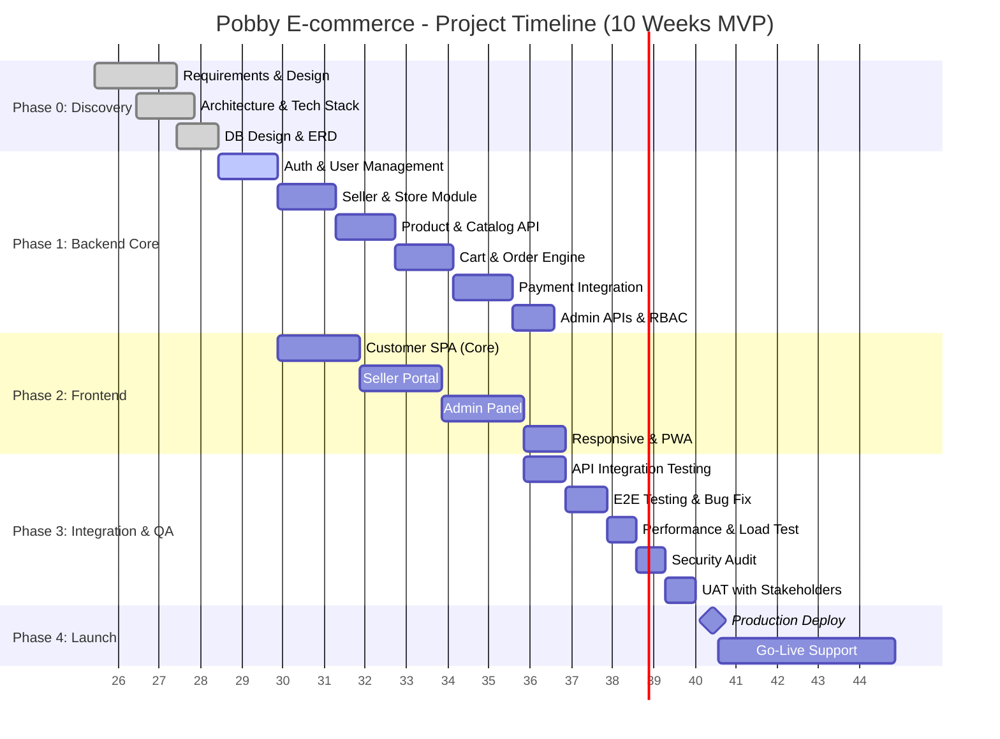

### 1.6.3 Chi tiết Sprint Plan (10 Sprints - 1 tuần/sprint)

| Sprint | Thời gian | Focus | Deliverables | Definition of Done |
|--------|-----------|-------|--------------|-------------------|
| **Sprint 0** | Tuần 1 (7/7-11/7) | Setup & Foundation | Repo, CI/CD, DB, Auth skeleton, Dev env | All devs can run locally, pipeline green |
| **Sprint 1** | Tuần 2 (14/7-18/7) | Auth & User Core | Register, Login, JWT, Profile, Role, Password reset | 100% auth APIs tested, Swagger doc |
| **Sprint 2** | Tuần 3 (21/7-25/7) | Seller Onboarding | Store registration, KYC, Approval workflow, Commission config | Seller can register → admin approve → go live |
| **Sprint 3** | Tuần 4 (28/7-1/8) | Product Catalog | Category CRUD, Product CRUD (variant, inventory), Search/Filter | 1000 products load < 500ms, full CRUD |
| **Sprint 4** | Tuần 5 (4/8-8/8) | Cart & Checkout | Cart persistence, Voucher, Shipping calc, COD/Bank order flow | End-to-end order placement working |
| **Sprint 5** | Tuần 6 (11/8-15/8) | Payment Gateway | Momo, VNPay integration, Webhook, Refund flow | Sandbox payment success, webhook verified |
| **Sprint 6** | Tuần 7 (18/8-22/8) | Seller Portal | Store dashboard, Product mgmt, Order mgmt, Payout request | Seller manages full lifecycle |
| **Sprint 7** | Tuần 8 (25/8-29/8) | Admin Panel | Dashboard KPI, User/Seller mgmt, Order oversight, Reports | Admin has 360° control |
| **Sprint 8** | Tuần 9 (1/9-5/9) | Customer Frontend | Home, Listing, Detail, Cart, Checkout, Orders, Profile | Full customer journey works |
| **Sprint 9** | Tuần 10 (8/9-12/9) | Hardening & Launch | Performance, Security, Bug bash, Docs, Deploy prod | All critical bugs fixed, load test passed |

---

## 1.7 Luồng kinh doanh (Business Process Flows)

### 1.7.1 Customer Journey (Hành trình khách hàng)

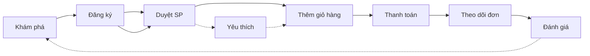

**Chi tiết từng bước:**

| Bước | Mô tả | Input | Output | KPI |
|------|-------|-------|--------|-----|
| **1. Khám phá** | Truy cập trang chủ, xem banner, sản phẩm nổi bật, danh mục | URL, device | Trang chủ hiển thị | Page view, bounce rate |
| **2. Đăng ký/TĐNH** | Tạo tài khoản hoặc đăng nhập | Email, password | Session active | Registration rate, login success |
| **3. Duyệt sản phẩm** | Tìm kiếm, lọc danh mục/giá, xem danh sách | Search query, filters | Danh sách SP phù hợp | Search rate, filter usage |
| **4. Xem chi tiết SP** | Xem thông tin, gallery, specs, reviews | Product ID | Trang chi tiết SP | View duration, add-to-cart rate |
| **5. Thêm giỏ hàng** | Chọn số lượng, thêm vào giỏ | ProductId, Quantity | Cart updated | Cart add rate, avg cart value |
| **6. Thanh toán** | Nhập thông tin giao hàng, chọn PT thanh toán, xác nhận | Shipping info, payment | Order created | Checkout completion rate |
| **7. Theo dõi đơn** | Xem trạng thái đơn hàng | Order ID | Order status display | Return visit rate |
| **8. Đánh giá** | Viết review, upload ảnh, rating | Rating, comment, images | Review published | Review rate, avg rating |

### 1.7.2 Seller Journey (Hành trình người bán)

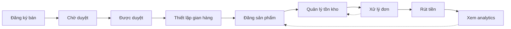

**Chi tiết từng bước:**

| Bước | Mô tả | Actor | Điều kiện | Output |
|------|-------|-------|-----------|--------|
| **1. Đăng ký Seller** | Điền form: tên shop, CMND/CCCD, ngành hàng, mô tả | Seller | Đã đăng ký tài khoản | Yêu cầu chờ duyệt |
| **2. KYC Review** | Admin xác minh thông tin, giấy tờ, duyệt/từ chối | Admin | Có yêu cầu pending | Approved / Rejected + lý do |
| **3. Setup Store** | Tên gian hàng, logo, banner, mô tả, chính sách | Seller | Approved | Store live trên marketplace |
| **4. Đăng sản phẩm** | Tên, mô tả, giá, số lượng, ảnh, category | Seller | Store approved | Product hiển thị trên frontend |
| **5. Quản lý tồn kho** | Cập nhật SL, đặt ngưỡng cảnh báo, import/export | Seller | Product exists | Inventory updated |
| **6. Xử lý đơn hàng** | Xác nhận → Đóng gói → Giao vận → Theo dõi | Seller | Order status = Pending/Processing | Order fulfilled |
| **7. Rút tiền** | Yêu cầu payout, chọn bank account, xác minh OTP | Seller | Balance > minimum threshold | Payout processed |
| **8. Analytics** | Xem doanh thu, sản phẩm bán chạy, conversion | Seller | None | Dashboard display |

### 1.7.3 Admin Journey (Hành trình quản trị viên)

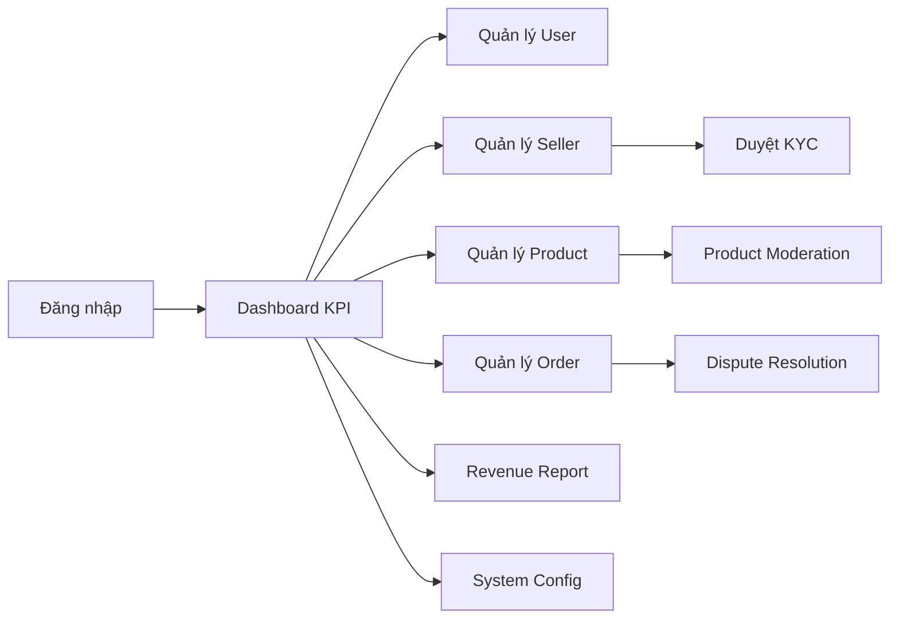

**Quy trình duyệt KYC:**
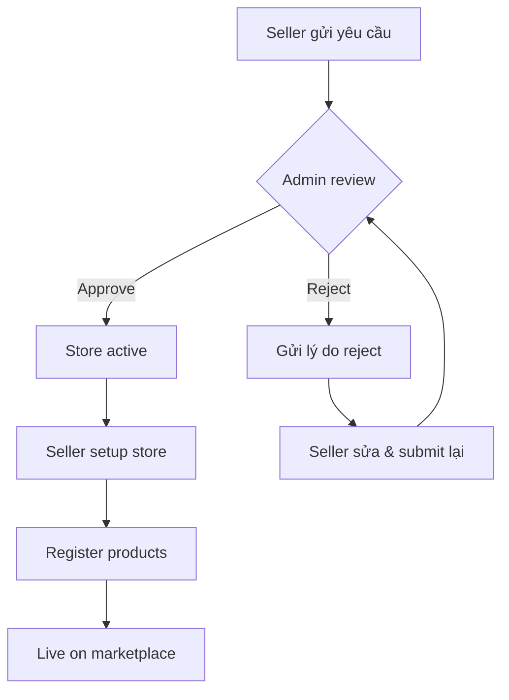

**Quy trình xử lý đơn hàng:**
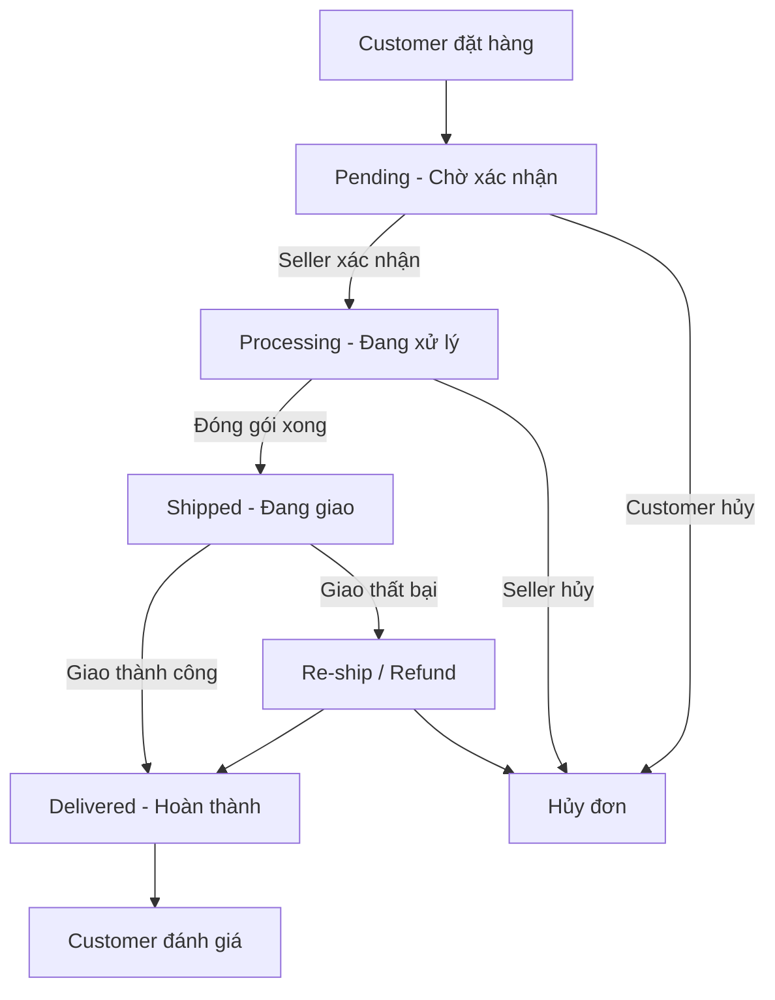

### 1.7.4 Order State Machine

| Trạng thái | Mã | Mô tả | Trigger | Hành động tiếp theo |
|-----------|-----|-------|---------|---------------------|
| **Pending** | `pending` | Đơn mới, chờ seller xác nhận | Customer checkout | Seller: Xác nhận / Hủy |
| **Processing** | `processing` | Seller đã nhận, đang đóng gói | Seller confirm | Seller: Ship |
| **Shipped** | `shipped` | Đã giao cho vận chuyển | Seller ship | Carrier: Deliver |
| **Delivered** | `delivered` | Giao thành công | Carrier confirm | Customer: Review, Reorder |
| **Cancelled** | `cancelled` | Đơn bị hủy | Customer/Seller/Admin | Refund if paid |
| **Refunding** | `refunding` | Đang hoàn tiền | Admin approve | Refunded |
| **Refunded** | `refunded` | Hoàn tiền thành công | Payment gateway | End state |

---

## 1.8 Quy tắc kinh doanh (Business Rules & Constraints)

### 1.8.1 Business Rules (BR)

| Mã | Rule | Phạm vi | Ưu tiên |
|----|------|---------|---------|
| **BR-001** | Guest (chưa đăng nhập) chỉ được xem sản phẩm, KHÔNG được thêm giỏ hàng hay thanh toán | Customer | Must |
| **BR-002** | Seller phải hoàn tất KYC (Admin approve) mới được đăng sản phẩm | Seller | Must |
| **BR-003** | Sản phẩm phải thuộc ít nhất 1 Category đang active để hiển thị trên frontend | Product | Must |
| **BR-004** | Khi tồn kho = 0, sản phẩm tự động ẩn khỏi frontend ( hoặc hiển thị "Hết hàng") | Inventory | Must |
| **BR-005** | Đơn hàng COD không yêu cầu thanh toán trước, bank/Momo/VNPay cần thanh toán thành công trước khi xử lý | Payment | Must |
| **BR-006** | Customer KHÔNG thể hủy đơn khi status = Shipped hoặc Delivered | Order | Must |
| **BR-007** | Seller chỉ thấy đơn hàng của gian hàng mình, Admin thấy toàn bộ | Authorization | Must |
| **BR-008** | Commission được tính tự động trên mỗi đơn hàng thành công (deliver), tỷ lệ theo config Admin | Finance | Must |
| **BR-009** | Payout yêu cầu minimum balance ≥ 100,000 VNĐ và max 1 lần/ngày | Finance | Must |
| **BR-010** | Guest checkout cho phép đặt hàng không cần tài khoản, nhưng phải nhập email + SĐT | Customer | Should |
| **BR-011** | Mỗi lần đăng nhập sai quá 5 lần sẽ khóa tài khoản 15 phút (rate limit) | Security | Must |
| **BR-012** | Password phải ≥ 8 ký tự,包含至少 1 chữ hoa, 1 chữ thường, 1 số | Security | Must |
| **BR-013** | Seller không được tự xóa sản phẩm đã có đơn hàng (soft delete only) | Data Integrity | Must |
| **BR-014** | Category không xóa được nếu còn sản phẩm thuộc về | Data Integrity | Must |
| **BR-015** | Admin có thể force update trạng thái đơn (override seller) | Admin | Must |
| **BR-016** | Giá sản phẩm phải ≥ giá nhập × (1 + min_margin%) | Pricing | Should |
| **BR-017** | Phí ship mặc định 25,000 VNĐ, miễn ship cho đơn ≥ 500,000 VNĐ | Shipping | Should |
| **BR-018** | Session JWT expire sau 15 phút, refresh token expire sau 7 ngày | Auth | Must |
| **BR-019** | Rate limit: 100 requests/phute cho API công, 30 requests/phute cho authenticated | Performance | Should |
| **BR-020** | Product images max 5 ảnh, mỗi ảnh ≤ 2MB, định dạng: JPG/PNG/WebP | Upload | Must |

### 1.8.2 Business Constraints (Hạn chế)

| Mã | Constraint | Chi tiết | Impact |
|----|-----------|----------|--------|
| **BC-01** | **Technical** | Frontend hiện tại dùng Vanilla JS, không SPA framework - khó maintain UI phức tạp | Medium |
| **BC-02** | **Technical** | Database SQL Server single instance, chưa có HA/DR | High |
| **BC-03** | **Budget** | Phase 1 budget giới hạn, phải ưu tiên MVP features | High |
| **BC-04** | **Timeline** | 10 tuần development, cần严格 phân priority | High |
| **BC-05** | **Legal** | Thuế VAT 8-10% trên GMV, cần tính toán pricing hợp lý | Medium |
| **BC-06** | **Regulation** | Luật E-commerce VN yêu cầu xác thực seller (CMND/CCCD) | High |
| **BC-07** | **Marketplace** | Phí commission cạnh tranh: Shopee 1-5%, Lazada 1-8%, Pobby cần < 5% | Medium |
| **BC-08** | **Data** | LocalStorage dung lượng ~5-10MB, KHÔNG phù hợp cho production data lớn | High |
| **BC-09** | **Security** | Chưa có WAF, CDN, DDoS protection ở Phase 1 | Medium |
| **BC-10** | **Scalability** | Flask single-process, chưa horizontal scale được | High |

---

*Phần 1: BRD - Hoàn thành ✓*
*Đang tiếp tục Phần 2: Functional Requirements (SRS)...*

---

# PHẦN 2: CHI TIẾT YÊU CẦU CHỨC NĂNG (SPECIFIC REQUIREMENTS / SRS)

## 2.1 Phân quyền & Ma trận vai trò (User Roles & Permission Matrix)

### 2.1.1 Danh sách vai trò (Roles)

| Mã | Vai trò | Mô tả | Quyền mặc định |
|----|---------|-------|----------------|
| **R-01** | **Guest** (Khách vãng lai) | Chưa đăng nhập, chỉ xem sản phẩm | View products, search, view detail |
| **R-02** | **Customer** (Khách hàng) | Người mua hàng đã đăng ký | Guest + cart, checkout, orders, profile, reviews, wishlist |
| **R-03** | **Seller** (Người bán) | Chủ gian hàng trên marketplace | Customer + store mgmt, product mgmt, order mgmt, payout, analytics |
| **R-04** | **Admin** (Quản trị viên) | Quản lý toàn hệ thống | Seller + user mgmt, seller mgmt, category, moderation, revenue, config |
| **R-05** | **Super Admin** (Quản trị cấp cao) | Toàn quyền, quản lý admin khác | Admin + role mgmt, audit logs, system config, impersonate |

### 2.1.2 Ma trận tính năng theo vai trò (Permission Matrix)

| Nhóm chức năng / Module | Guest | Customer | Seller | Admin | Super Admin |
|--------------------------|:-----:|:--------:|:------:|:-----:|:-----------:|
| **Xem sản phẩm** | | | | | |
| - Duyệt danh mục sản phẩm | ✅ | ✅ | ✅ | ✅ | ✅ |
| - Xem chi tiết sản phẩm | ✅ | ✅ | ✅ | ✅ | ✅ |
| - Tìm kiếm & lọc sản phẩm | ✅ | ✅ | ✅ | ✅ | ✅ |
| **Giỏ hàng** | | | | | |
| - Thêm sản phẩm vào giỏ | ❌ | ✅ | ✅ | ✅ | ✅ |
| - Cập nhật số lượng | ❌ | ✅ | ✅ | ✅ | ✅ |
| - Xóa sản phẩm khỏi giỏ | ❌ | ✅ | ✅ | ✅ | ✅ |
| **Thanh toán** | | | | | |
| - Tạo đơn hàng | ❌ | ✅ | ✅ | ✅ | ✅ |
| - Chọn phương thức thanh toán | ❌ | ✅ | ✅ | ✅ | ✅ |
| - Theo dõi trạng thái đơn hàng | ❌ | ✅ | ✅ | ✅ | ✅ |
| **Tài khoản** | | | | | |
| - Đăng ký / Đăng nhập | ✅ | ✅ | ✅ | ✅ | ✅ |
| - Cập nhật thông tin cá nhân | ❌ | ✅ | ✅ | ✅ | ✅ |
| - Đổi mật khẩu | ❌ | ✅ | ✅ | ✅ | ✅ |
| - Quản lý địa chỉ giao hàng | ❌ | ✅ | ✅ | ✅ | ✅ |
| **Seller Portal** | | | | | |
| - Đăng ký gian hàng | ❌ | ✅ | ✅ | ✅ | ✅ |
| - Quản lý sản phẩm (CRUD) | ❌ | ❌ | ✅ | ✅ | ✅ |
| - Quản lý tồn kho | ❌ | ❌ | ✅ | ✅ | ✅ |
| - Xử lý đơn hàng của shop | ❌ | ❌ | ✅ | ✅ | ✅ |
| - Xem doanh thu & rút tiền | ❌ | ❌ | ✅ | ✅ | ✅ |
| **Admin Panel** | | | | | |
| - Dashboard thống kê | ❌ | ❌ | ❌ | ✅ | ✅ |
| - Quản lý người dùng | ❌ | ❌ | ❌ | ✅ | ✅ |
| - Duyệt Seller (KYC) | ❌ | ❌ | ❌ | ✅ | ✅ |
| - Quản lý danh mục | ❌ | ❌ | ❌ | ✅ | ✅ |
| - Duyệt/ẩn sản phẩm | ❌ | ❌ | ❌ | ✅ | ✅ |
| - Quản lý đơn hàng toàn hệ thống | ❌ | ❌ | ❌ | ✅ | ✅ |
| - Báo cáo doanh thu & commission | ❌ | ❌ | ❌ | ✅ | ✅ |
| - Cấu hình hệ thống | ❌ | ❌ | ❌ | ❌ | ✅ |
| - Quản lý vai trò & phân quyền | ❌ | ❌ | ❌ | ❌ | ✅ |
| - Xem audit logs | ❌ | ❌ | ❌ | ❌ | ✅ |

### 2.1.3 RBAC Design (Role-Based Access Control)

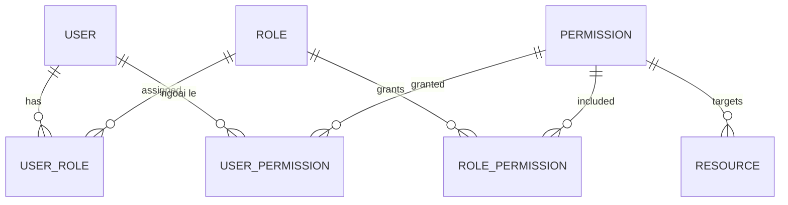

**Cấu trúc bảng phân quyền:**
- `Users` (ma_user, ten_user, tendangnhap, mat_khau, ma_nhom_quyen, status)
- `NhomQuyen` (ma_nhom_quyen, ten_nhom_quyen, mo_ta)
- `ChucNang` (ma_chuc_nang, ten_chuc_nang, ma_cha, url, icon)
- `PhanQuyen` (ma_phan_quyen, ma_nhom_quyen, ma_chuc_nang, quyen_xem, quyen_them, quyen_sua, quyen_xoa)
- `UserPhanQuyen` (ma_user, ma_chuc_nang, quyen_ngoai_le) - phân quyền ngoại lệ

---

## 2.2 Mô tả chi tiết các Module (Description of Modules)

### A. MODULE FRONTEND KHÁCH HÀNG (Customer Frontend)

| BR# | Tên Module | Vai trò | Mô tả chi tiết luồng nghiệp vụ | Priority |
|-----|------------|---------|-------------------------------|----------|
| **BR01** | Duyệt sản phẩm | Customer | Xem danh sách SP theo danh mục (BABY-G, EDIFICE, G-SHOCK, PRO-TREK, SHEEN), lọc theo giá, tìm kiếm theo tên. Hiển thị 12 SP/trang với phân trang. | Must |
| **BR02** | Chi tiết sản phẩm | Customer | Hiển thị đầy đủ: hình ảnh, tên, giá, mô tả, thông số kỹ thuật (chất liệu, kích thước, chống nước, xuất xứ). Chọn số lượng, thêm vào giỏ. | Must |
| **BR03** | Giỏ hàng | Customer | Slide-out modal hiển thị SP đã thêm, tăng/giảm SL, xóa SP. Hiển thị tổng tiền, nút chuyển thanh toán. | Must |
| **BR04** | Thanh toán | Customer | Form thông tin giao hàng (tên, SĐT, email, địa chỉ), chọn PT thanh toán (COD, Chuyển khoản, Thanh toán tại cửa hàng). Xác nhận & lưu đơn. | Must |
| **BR05** | Theo dõi đơn hàng | Customer | Danh sách đơn với trạng thái: Chờ xác nhận → Đã xử lý → Đã giao → Hủy. Hủy đơn khi ở trạng thái "Chờ xác nhận". | Must |
| **BR06** | Đăng ký tài khoản | Customer | Form: tên đăng nhập, email, mật khẩu, xác nhận mật khẩu. Validation: email hợp lệ, mật khẩu ≥ 6 ký tự, tên đăng nhập duy nhất. | Must |
| **BR07** | Đăng nhập | Customer | Form đăng nhập với tên đăng nhập & mật khẩu. Lưu trạng thái đăng nhập. Hiển thị lỗi nếu sai thông tin. | Must |
| **BR08** | Quản lý hồ sơ | Customer | Cập nhật: tên, email, SĐT, địa chỉ, ảnh đại diện. Form đổi mật khẩu với xác nhận mật khẩu cũ. | Must |
| **BR08S** | Sổ địa chỉ | Customer | Quản lý nhiều địa chỉ giao hàng, chọn địa chỉ mặc định, thêm/sửa/xóa địa chỉ. | Should |
| **BR10** | Yêu thích (Wishlist) | Customer | Lưu sản phẩm yêu thích, xem danh sách, thêm nhanh vào giỏ. | Should |
| **BR12** | Thông báo | Customer | Thông báo trạng thái đơn, khuyến mãi, tin nhắn từ seller. | Could |

### 2.2.1 Chi tiết luồng nghiệp vụ - BR01: Duyệt sản phẩm

**Mô tả:** Khách hàng duyệt danh sách sản phẩm theo danh mục, lọc theo giá, tìm kiếm theo tên.

**Luồng chính:**
1. User truy cập trang chủ → hệ thống hiển thị danh sách SP nổi bật
2. User chọn danh mục (BABY-G, EDIFICE, G-SHOCK, PRO-TREK, SHEEN) → lọc SP theo catalog
3. User nhập từ khóa tìm kiếm → hệ thống tìm theo tên SP
4. User lọc theo khoảng giá (min-max) → hệ thống lọc SP trong khoảng
5. Hệ thống hiển thị 12 SP/trang, phân trang

**Luồng ngoại lệ:**
- Không có SP phù hợp → hiển thị "Không tìm thấy sản phẩm"
- Danh mục trống → hiển thị thông báo danh mục chưa có SP

**Validation Rules:**
- Từ khóa tìm kiếm: 1-100 ký tự, không chứa ký tự đặc biệt nguy hiểm
- Khoảng giá: min ≤ max, cả hai ≥ 0

### 2.2.2 Chi tiết luồng nghiệp vụ - BR04: Thanh toán

**Mô tả:** Khách hàng nhập thông tin giao hàng, chọn phương thức thanh toán, xác nhận đơn hàng.

**Luồng chính:**
1. User mở giỏ hàng → chọn "Thanh toán"
2. Hệ thống hiển thị form: tên, SĐT, email, địa chỉ giao hàng
3. User chọn phương thức thanh toán: COD / Chuyển khoản / Thanh toán tại cửa hàng
4. Hệ thống tính tổng tiền: SubTotal + ShippingFee - Discount
5. User xác nhận → hệ thống tạo đơn hàng (status = Chờ xác nhận)
6. Hệ thống trừ tồn kho, cập nhật soldQuantity, xóa giỏ hàng
7. Hiển thị thông báo thành công + mã đơn hàng

**Luồng ngoại lệ:**
- Tồn kho không đủ → thông báo lỗi, yêu cầu giảm SL
- SĐT/email không hợp lệ → validation error
- Giỏ hàng trống → chuyển hướng về trang sản phẩm

**Validation Rules:**
- Tên: 2-50 ký tự, không số
- SĐT: 10-11 số, bắt đầu 0 (VN)
- Email: format chuẩn
- Địa chỉ: 5-200 ký tự

### 2.2.3 Chi tiết luồng nghiệp vụ - BR05: Theo dõi đơn hàng

**Mô tả:** Khách hàng xem danh sách đơn hàng và trạng thái, hủy đơn khi ở trạng thái chờ xác nhận.

**Luồng chính:**
1. User vào "Lịch sử đơn hàng"
2. Hệ thống hiển thị danh sách đơn của user (mới nhất trước)
3. User xem chi tiết đơn: sản phẩm, tổng tiền, trạng thái, ngày đặt
4. Nếu status = Chờ xác nhận → user có nút "Hủy đơn"
5. User xác nhận hủy → hệ thống cập nhật status = Hủy, hoàn tồn kho

**Luồng ngoại lệ:**
- Đơn đã xử lý/giao → không hiển thị nút hủy
- Hủy đơn COD → không cần hoàn tiền
- Hủy đơn đã thanh toán → tạo yêu cầu hoàn tiền

---

*Đang tiếp tục Batch 2/3: Seller Portal & Admin Panel Modules...*

---

### B. MODULE SELLER PORTAL (Kênh người bán)

| BR# | Tên Module | Vai trò | Mô tả chi tiết luồng nghiệp vụ | Priority |
|-----|------------|---------|-------------------------------|----------|
| **BR13** | Đăng ký gian hàng | Seller | Form đăng ký: tên shop, SĐT kinh doanh, ngành hàng, mô tả, CMND/CCCD. Gửi yêu cầu → Admin duyệt/từ chối. | Must |
| **BR14** | Quản lý gian hàng | Seller | Cập nhật logo, banner, mô tả, chính sách shop, thông tin liên hệ. Xem thống kê shop. | Must |
| **BR15** | Quản lý sản phẩm | Seller | CRUD sản phẩm: tên, mô tả, giá, giá gốc, số lượng, emoji, ảnh, category. Ẩn/hiện sản phẩm. | Must |
| **BR16** | Quản lý tồn kho | Seller | Xem số lượng tồn, cập nhật SL, cảnh báo tồn kho thấp, import/export danh sách. | Must |
| **BR17** | Quản lý đơn hàng | Seller | Xem đơn của shop, xác nhận đơn, cập nhật trạng thái (xử lý → giao → hoàn thành), xem chi tiết. | Must |
| **BR18** | Doanh thu & Rút tiền | Seller | Dashboard doanh thu, chi tiết giao dịch, commission, yêu cầu rút tiền, lịch sử payout. | Must |
| **BR19** | Phân tích bán hàng | Seller | Báo cáo: sản phẩm bán chạy, doanh thu theo ngày/tuần/tháng, conversion, đánh giá khách hàng. | Should |

### 2.2.4 Chi tiết luồng nghiệp vụ - BR13: Đăng ký gian hàng

**Mô tả:** Người dùng đăng ký trở thành Seller, gửi yêu cầu cho Admin duyệt.

**Luồng chính:**
1. User đã đăng nhập → chọn "Đăng ký bán"
2. Hệ thống hiển thị form: UserId, ShopName, BusinessPhone, Category, Description, NationalId
3. User điền thông tin → submit
4. Hệ thống tạo YeuCau (yêu cầu) với trạng thái Pending
5. Admin xem danh sách yêu cầu → duyệt (approve) hoặc từ chối (reject + lý do)
6. Nếu approve → tạo GianHang (store) cho user, user có quyền Seller
7. Nếu reject → user nhận thông báo lý do, có thể sửa & gửi lại

**Luồng ngoại lệ:**
- User đã có gian hàng → thông báo "Bạn đã là Seller"
- CMND/CCCD trùng → cảnh báo trùng lặp
- Yêu cầu đang pending → không cho gửi lại

**Validation Rules:**
- ShopName: 3-100 ký tự, duy nhất
- BusinessPhone: 10-11 số
- NationalId: 9-12 số (CMND/CCCD)
- Category: bắt buộc, thuộc danh sách ngành hàng

### 2.2.5 Chi tiết luồng nghiệp vụ - BR15: Quản lý sản phẩm (Seller)

**Mô tả:** Seller thêm/sửa/ẩn sản phẩm của gian hàng mình.

**Luồng chính:**
1. Seller vào "Quản lý sản phẩm"
2. Hệ thống hiển thị danh sách SP của shop (phân trang 10 SP/trang)
3. Seller chọn "Thêm sản phẩm" → form: name, description, price, old_price, quantity, emoji, image_url, category_id
4. Seller submit → hệ thống tạo SP với StoreId = shop của seller
5. Seller có thể sửa thông tin, ẩn/hiện SP (soft delete)
6. Seller có thể xóa SP (chỉ khi chưa có đơn hàng)

**Luồng ngoại lệ:**
- Category không tồn tại → lỗi validation
- Giá ≤ 0 → lỗi
- Số lượng âm → lỗi

**Validation Rules:**
- name: 2-200 ký tự
- price, old_price: > 0, old_price ≥ price (nếu có)
- quantity: ≥ 0
- image_url: URL hợp lệ

### 2.2.6 Chi tiết luồng nghiệp vụ - BR18: Doanh thu & Rút tiền

**Mô tả:** Seller xem doanh thu, commission và yêu cầu rút tiền.

**Luồng chính:**
1. Seller vào "Doanh thu"
2. Hệ thống tính: Tổng doanh thu = Σ(đơn hoàn thành) - Commission
3. Seller xem chi tiết từng giao dịch, commission đã trừ
4. Seller chọn "Rút tiền" → nhập số tiền, chọn tài khoản ngân hàng
5. Hệ thống kiểm tra: số dư ≥ 100,000 VNĐ, max 1 lần/ngày
6. Tạo yêu cầu payout → Admin duyệt → chuyển tiền

**Luồng ngoại lệ:**
- Số dư không đủ → thông báo
- Đã rút hôm nay → thông báo giới hạn
- Chưa có tài khoản ngân hàng → yêu cầu thêm

---

### C. MODULE ADMIN PANEL (Quản trị viên)

| BR# | Tên Module | Vai trò | Mô tả chi tiết luồng nghiệp vụ | Priority |
|-----|------------|---------|-------------------------------|----------|
| **BR20** | Dashboard | Admin | Hiển thị 4 KPI chính: Tổng khách hàng, Tổng sản phẩm, Tổng đơn hàng, Tổng doanh thu. Cập nhật real-time. | Must |
| **BR21** | Quản lý người dùng | Admin | Xem danh sách user, tìm kiếm theo tên/email/SĐT. Khóa/mở khóa tài khoản, đặt lại mật khẩu, phân vai trò. | Must |
| **BR22** | Quản lý Seller | Admin | Duyệt/từ chối yêu cầu đăng ký gian hàng, xem hồ sơ seller, cấu hình commission, khóa seller. | Must |
| **BR23** | Quản lý danh mục | Admin | CRUD danh mục sản phẩm (6 bộ sưu tập Casio). Thêm/sửa/xóa, thay đổi trạng thái hiển thị. | Must |
| **BR24** | Quản lý sản phẩm | Admin | CRUD sản phẩm toàn hệ thống, upload ảnh, ẩn/hiện (soft delete). Lọc theo danh mục, tìm theo ID/tên. Phân trang 10 SP/trang. | Must |
| **BR25** | Quản lý đơn hàng | Admin | Xem toàn bộ đơn, lọc theo ngày/trạng thái/mã đơn. Xem chi tiết (thông tin KH, SP, tổng tiền). Cập nhật trạng thái: Mới đặt → Đã xử lý → Đã giao → Hủy. | Must |
| **BR26** | Quản lý tồn kho | Admin | Hiển thị tồn kho theo SP, cảnh báo tồn kho thấp (dưới ngưỡng). Lọc theo danh mục. | Must |
| **BR27** | Quản lý nhập hàng | Admin | Tạo phiếu nhập hàng từ nhà cung cấp, xem lịch sử nhập. Chi tiết: mã phiếu, ngày nhập, SP, số lượng, giá nhập, thành tiền. | Must |
| **BR28** | Quản lý giá bán | Admin | Thiết lập tỷ lệ lợi nhuận, tự động tính giá bán từ giá nhập. Áp dụng cho từng SP hoặc theo danh mục. | Should |
| **BR29** | Báo cáo doanh thu | Admin | Biểu đồ doanh thu theo thời gian, lọc theo khoảng ngày. Top SP bán chạy, thống kê theo danh mục. | Must |
| **BR30** | Phân quyền & Vai trò | Super Admin | CRUD nhóm quyền, gán quyền cho nhóm, phân quyền ngoại lệ cho user, áp dụng quyền nhóm cho user. | Must |
| **BR31** | Audit Logs | Super Admin | Xem lịch sử hoạt động: đăng nhập, thay đổi dữ liệu, phân quyền. Export log. | Should |

### 2.2.7 Chi tiết luồng nghiệp vụ - BR20: Dashboard

**Mô tả:** Admin xem tổng quan KPI hệ thống real-time.

**Luồng chính:**
1. Admin đăng nhập → vào Dashboard
2. Hệ thống gọi API `/api/thong-ke/tong-quan` → hiển thị 4 KPI:
   - Tổng khách hàng (users active)
   - Tổng sản phẩm (products active)
   - Tổng đơn hàng (orders)
   - Tổng doanh thu (sum totalAmount của đơn hoàn thành)
3. Hệ thống gọi API `/api/thong-ke/doanh-thu-theo-thang?year=2026` → biểu đồ doanh thu 12 tháng
4. Dashboard tự refresh khi có thay đổi (polling/websocket)

**Luồng ngoại lệ:**
- Không có dữ liệu → hiển thị 0
- API lỗi → hiển thị thông báo retry

### 2.2.8 Chi tiết luồng nghiệp vụ - BR25: Quản lý đơn hàng (Admin)

**Mô tả:** Admin xem và cập nhật trạng thái đơn hàng toàn hệ thống.

**Luồng chính:**
1. Admin vào "Quản lý đơn hàng"
2. Hệ thống gọi API `/api/don-hang/tat-ca` → hiển thị danh sách đơn
3. Admin lọc theo: ngày, trạng thái, mã đơn
4. Admin xem chi tiết đơn: thông tin KH, sản phẩm, tổng tiền, phí ship, PT thanh toán
5. Admin cập nhật trạng thái: Mới đặt → Đã xử lý → Đã giao → Hủy
6. Hệ thống gọi API `/api/don-hang/{id}/trang-thai` → cập nhật DB

**Luồng ngoại lệ:**
- Đơn đã hủy → không cho đổi trạng thái
- Cập nhật trạng thái ngược (giao → xử lý) → cảnh báo

### 2.2.9 Chi tiết luồng nghiệp vụ - BR30: Phân quyền & Vai trò

**Mô tả:** Super Admin quản lý nhóm quyền và phân quyền cho user.

**Luồng chính:**
1. Super Admin vào "Phân quyền"
2. Xem danh sách nhóm quyền (Roles): Customer, Seller, Admin, Super Admin
3. Thêm/sửa/xóa nhóm quyền
4. Chọn nhóm → gán quyền cho từng chức năng (xem/thêm/sửa/xóa)
5. Gán nhóm quyền cho user (áp dụng quyền nhóm)
6. Phân quyền ngoại lệ: gán quyền riêng cho từng user (override nhóm)

**Luồng ngoại lệ:**
- Không thể xóa nhóm quyền đang được sử dụng
- Không thể xóa quyền Super Admin của chính mình

---

*Đang tiếp tục Batch 3/3: Functional Requirements List, Use Cases & Data Requirements...*

---

## 2.3 Danh sách Yêu cầu Chức năng chi tiết (Functional Requirements)

### 2.3.1 Yêu cầu chức năng - Khách hàng (Customer)

| Mã | Yêu cầu | Mô tả chi tiết | Module | Ưu tiên |
|----|---------|----------------|--------|---------|
| **FR-01** | Duyệt sản phẩm theo danh mục | Hệ thống cho phép khách hàng duyệt SP theo danh mục (BABY-G, EDIFICE, G-SHOCK, PRO-TREK, SHEEN) và lọc theo giá | BR01 | Must |
| **FR-02** | Tìm kiếm sản phẩm theo tên | Hệ thống cho phép khách hàng tìm kiếm SP theo tên, hiển thị kết quả phù hợp | BR01 | Must |
| **FR-03** | Xem chi tiết sản phẩm | Hệ thống hiển thị đầy đủ thông tin SP: hình ảnh, tên, giá, mô tả, thông số kỹ thuật | BR02 | Must |
| **FR-04** | Thêm sản phẩm vào giỏ hàng | Hệ thống cho phép khách hàng thêm SP vào giỏ hàng với số lượng tùy chọn | BR03 | Must |
| **FR-05** | Cập nhật giỏ hàng | Hệ thống cho phép tăng/giảm số lượng, xóa SP khỏi giỏ hàng | BR03 | Must |
| **FR-06** | Thanh toán đơn hàng | Hệ thống cho phép khách hàng nhập thông tin giao hàng, chọn PT thanh toán, xác nhận đơn | BR04 | Must |
| **FR-07** | Theo dõi trạng thái đơn hàng | Hệ thống hiển thị danh sách đơn hàng với trạng thái: Chờ xác nhận → Đã xử lý → Đã giao → Hủy | BR05 | Must |
| **FR-08** | Hủy đơn hàng | Hệ thống cho phép khách hàng hủy đơn khi ở trạng thái "Chờ xác nhận" | BR05 | Must |
| **FR-09** | Đăng ký tài khoản | Hệ thống cho phép khách hàng đăng ký với validation: email hợp lệ, mật khẩu ≥ 6 ký tự, tên đăng nhập duy nhất | BR06 | Must |
| **FR-10** | Đăng nhập | Hệ thống cho phép khách hàng đăng nhập, lưu trạng thái, hiển thị lỗi nếu sai thông tin | BR07 | Must |
| **FR-11** | Cập nhật hồ sơ | Hệ thống cho phép cập nhật: tên, email, SĐT, địa chỉ, ảnh đại diện | BR08 | Must |
| **FR-12** | Đổi mật khẩu | Hệ thống cho phép đổi mật khẩu với xác nhận mật khẩu cũ | BR08 | Must |
| **FR-13** | Quản lý sổ địa chỉ | Hệ thống cho phép thêm/sửa/xóa nhiều địa chỉ, chọn địa chỉ mặc định | BR08S | Should |
| **FR-14** | Yêu thích sản phẩm | Hệ thống cho phép lưu SP yêu thích, xem danh sách, thêm nhanh vào giỏ | BR10 | Should |

### 2.3.2 Yêu cầu chức năng - Seller (Người bán)

| Mã | Yêu cầu | Mô tả chi tiết | Module | Ưu tiên |
|----|---------|----------------|--------|---------|
| **FR-16** | Đăng ký gian hàng | Hệ thống cho phép user đăng ký gian hàng, gửi yêu cầu cho Admin duyệt | BR13 | Must |
| **FR-17** | Duyệt yêu cầu Seller | Hệ thống cho phép Admin duyệt/từ chối yêu cầu đăng ký gian hàng kèm lý do | BR22 | Must |
| **FR-18** | Quản lý sản phẩm (Seller) | Hệ thống cho phép Seller CRUD sản phẩm của gian hàng mình | BR15 | Must |
| **FR-19** | Quản lý tồn kho (Seller) | Hệ thống cho phép Seller xem/cập nhật tồn kho, cảnh báo tồn kho thấp | BR16 | Must |
| **FR-20** | Xử lý đơn hàng (Seller) | Hệ thống cho phép Seller xem đơn của shop, xác nhận, cập nhật trạng thái | BR17 | Must |
| **FR-21** | Xem doanh thu & rút tiền | Hệ thống cho phép Seller xem doanh thu, commission, yêu cầu rút tiền | BR18 | Must |
| **FR-22** | Phân tích bán hàng | Hệ thống cung cấp báo cáo bán hàng cho Seller: SP bán chạy, doanh thu theo thời gian | BR19 | Should |

### 2.3.3 Yêu cầu chức năng - Admin (Quản trị viên)

| Mã | Yêu cầu | Mô tả chi tiết | Module | Ưu tiên |
|----|---------|----------------|--------|---------|
| **FR-23** | Dashboard thống kê | Hệ thống hiển thị 4 KPI: Tổng khách hàng, Tổng SP, Tổng đơn, Tổng doanh thu, cập nhật real-time | BR20 | Must |
| **FR-24** | Quản lý người dùng | Hệ thống cho phép Admin xem, tìm kiếm, khóa/mở khóa, đặt lại mật khẩu, phân vai trò user | BR21 | Must |
| **FR-25** | Quản lý danh mục | Hệ thống cho phép Admin CRUD danh mục sản phẩm, thay đổi trạng thái hiển thị | BR23 | Must |
| **FR-26** | Quản lý sản phẩm (Admin) | Hệ thống cho phép Admin CRUD sản phẩm toàn hệ thống, ẩn/hiện (soft delete) | BR24 | Must |
| **FR-27** | Quản lý đơn hàng (Admin) | Hệ thống cho phép Admin xem toàn bộ đơn, lọc, xem chi tiết, cập nhật trạng thái | BR25 | Must |
| **FR-28** | Quản lý tồn kho (Admin) | Hệ thống hiển thị tồn kho theo SP, cảnh báo tồn kho thấp, lọc theo danh mục | BR26 | Must |
| **FR-29** | Quản lý nhập hàng | Hệ thống cho phép Admin tạo phiếu nhập hàng, xem lịch sử nhập | BR27 | Must |
| **FR-30** | Quản lý giá bán | Hệ thống cho phép thiết lập tỷ lệ lợi nhuận, tự động tính giá bán từ giá nhập | BR28 | Should |
| **FR-31** | Báo cáo doanh thu | Hệ thống cung cấp biểu đồ doanh thu theo thời gian, top SP bán chạy, thống kê theo danh mục | BR29 | Must |
| **FR-32** | Phân quyền & Vai trò | Hệ thống cho phép Super Admin CRUD nhóm quyền, gán quyền, phân quyền ngoại lệ | BR30 | Must |
| **FR-33** | Audit Logs | Hệ thống ghi lại và hiển thị lịch sử hoạt động của người dùng | BR31 | Should |

### 2.3.4 Yêu cầu chức năng - Hệ thống (System)

| Mã | Yêu cầu | Mô tả chi tiết | Ưu tiên |
|----|---------|----------------|---------|
| **FR-34** | Xác thực & Phân quyền | Hệ thống xác thực người dùng (JWT), phân quyền truy cập theo vai trò (RBAC) | Must |
| **FR-35** | Quản lý phiên | Hệ thống quản lý phiên đăng nhập, tự động hết hạn sau thời gian quy định | Must |
| **FR-36** | Validation đầu vào | Hệ thống kiểm tra và validate toàn bộ dữ liệu đầu vào trước khi xử lý | Must |
| **FR-37** | Xử lý lỗi & Logging | Hệ thống bắt lỗi, ghi log, trả về thông báo lỗi thân thiện | Must |
| **FR-38** | Backup & Restore | Hệ thống hỗ trợ xuất/nhập dữ liệu JSON để backup và restore | Should |
| **FR-39** | Responsive Design | Hệ thống hiển thị tối ưu trên desktop, tablet, mobile | Must |

---

## 2.4 Use Cases & User Stories

### 2.4.1 Use Case Diagram (Tổng quan)

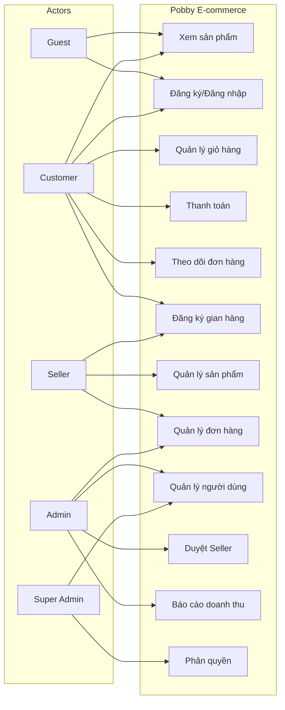

### 2.4.2 User Stories chi tiết

| ID | User Story | Acceptance Criteria | Story Points |
|----|-----------|---------------------|--------------|
| **US-01** | Là khách hàng, tôi muốn tìm kiếm SP theo tên để nhanh chóng tìm được SP mình cần | Kết quả tìm kiếm hiển thị trong < 500ms, đúng SP phù hợp, phân trang 12 SP/trang | 3 |
| **US-02** | Là khách hàng, tôi muốn thêm SP vào giỏ hàng để mua nhiều SP cùng lúc | SP xuất hiện trong slide-out cart, tổng tiền tính đúng, badge cập nhật | 2 |
| **US-03** | Là khách hàng, tôi muốn thanh toán COD để không cần thẻ ngân hàng | Form validation đúng, đơn tạo thành công, trừ tồn kho, xóa giỏ | 5 |
| **US-04** | Là khách hàng, tôi muốn hủy đơn khi chờ xác nhận để sửa sai sót | Nút hủy chỉ hiển thị khi status = Chờ xác nhận, hủy thành công hoàn tồn kho | 3 |
| **US-05** | Là seller, tôi muốn đăng ký gian hàng để bán sản phẩm trên nền tảng | Form đăng ký hợp lệ, yêu cầu gửi đến Admin, nhận thông báo kết quả | 5 |
| **US-06** | Là seller, tôi muốn quản lý sản phẩm của shop để cập nhật giá/tồn kho | CRUD SP thành công, chỉ thấy SP của shop mình, phân trang 10 SP/trang | 5 |
| **US-07** | Là admin, tôi muốn xem dashboard KPI để nắm tình hình kinh doanh | 4 KPI hiển thị đúng, biểu đồ doanh thu 12 tháng, refresh real-time | 3 |
| **US-08** | Là admin, tôi muốn duyệt seller để kiểm soát chất lượng gian hàng | Duyệt/từ chối kèm lý do, seller nhận thông báo, store active sau approve | 3 |
| **US-09** | Là admin, tôi muốn xem báo cáo doanh thu theo khoảng ngày để phân tích | Lọc theo ngày đúng, biểu đồ chính xác, top SP bán chạy hiển thị | 5 |
| **US-10** | Là super admin, tôi muốn phân quyền cho user để kiểm soát truy cập | Tạo nhóm quyền, gán quyền chức năng, phân quyền ngoại lệ, áp dụng cho user | 8 |

### 2.4.3 Use Case chi tiết - UC-04: Thanh toán đơn hàng

**Actor:** Customer  
**Precondition:** Đã đăng nhập, giỏ hàng có SP  
**Postcondition:** Đơn hàng được tạo, tồn kho giảm, giỏ hàng trống

**Main Flow:**
1. User mở giỏ hàng → chọn "Thanh toán"
2. Hệ thống hiển thị form thông tin giao hàng
3. User nhập: tên, SĐT, email, địa chỉ
4. User chọn PT thanh toán: COD / Chuyển khoản / Tại cửa hàng
5. Hệ thống tính tổng: SubTotal + ShippingFee - Discount
6. User xác nhận → hệ thống tạo DonHang + OrderItems
7. Hệ thống trừ tồn kho, tăng soldQuantity
8. Hệ thống xóa giỏ hàng, hiển thị mã đơn thành công

**Alternative Flow:**
- 6a. Tồn kho không đủ → thông báo lỗi, không tạo đơn
- 6b. Validation lỗi → hiển thị lỗi cụ thể từng trường

**Exception Flow:**
- Giỏ hàng trống → chuyển hướng về trang SP
- Server lỗi → thông báo "Vui lòng thử lại"

---

## 2.5 Yêu cầu dữ liệu (Data Requirements)

### 2.5.1 Data Dictionary - Bảng Users

| Trường | Kiểu dữ liệu | Ràng buộc | Mô tả |
|--------|--------------|-----------|-------|
| ma_user | INT | PK, Identity | Mã người dùng |
| ma_nhom_quyen | INT | FK → NhomQuyen, Default 2 | Nhóm quyền |
| ten_user | NVARCHAR(100) | NOT NULL | Tên người dùng |
| dia_chi | NVARCHAR(255) | NULL | Địa chỉ |
| sdt | VARCHAR(15) | NULL, unique | Số điện thoại |
| cmnd | VARCHAR(20) | NULL, unique | CMND/CCCD |
| tendangnhap | VARCHAR(50) | NOT NULL, unique | Tên đăng nhập |
| mat_khau | VARCHAR(255) | NOT NULL | Mật khẩu (hash) |
| status | VARCHAR(20) | active/blocked | Trạng thái |

### 2.5.2 Data Dictionary - Bảng Products

| Trường | Kiểu dữ liệu | Ràng buộc | Mô tả |
|--------|--------------|-----------|-------|
| ProductId | INT | PK, Identity | Mã sản phẩm |
| ProductName | NVARCHAR(200) | NOT NULL | Tên sản phẩm |
| Description | NVARCHAR(MAX) | NULL | Mô tả |
| Price | DECIMAL(18,2) | NOT NULL, > 0 | Giá bán |
| OldPrice | DECIMAL(18,2) | NULL | Giá gốc |
| Quantity | INT | NOT NULL, ≥ 0 | Số lượng tồn |
| Rating | FLOAT | 0-5 | Đánh giá trung bình |
| SoldCount | INT | ≥ 0 | Số lượng đã bán |
| Emoji | NVARCHAR(10) | NULL | Biểu tượng |
| ImageUrl | NVARCHAR(500) | NULL | Đường dẫn ảnh |
| CategoryId | INT | FK → Categories | Danh mục |
| StoreId | INT | FK → Stores | Gian hàng |
| IsActive | BIT | Default 1 | Trạng thái hiển thị |

### 2.5.3 Data Dictionary - Bảng Orders

| Trường | Kiểu dữ liệu | Ràng buộc | Mô tả |
|--------|--------------|-----------|-------|
| OrderId | INT | PK, Identity | Mã đơn hàng |
| UserId | INT | FK → Users | Người đặt |
| ReceiverName | NVARCHAR(100) | NOT NULL | Tên người nhận |
| ReceiverPhone | VARCHAR(15) | NOT NULL | SĐT người nhận |
| ShippingAddress | NVARCHAR(255) | NOT NULL | Địa chỉ giao |
| PaymentMethod | VARCHAR(20) | COD/PayBank/PayInStore | PT thanh toán |
| SubTotal | DECIMAL(18,2) | ≥ 0 | Tạm tính |
| ShippingFee | DECIMAL(18,2) | ≥ 0 | Phí ship |
| DiscountAmount | DECIMAL(18,2) | ≥ 0 | Giảm giá |
| TotalAmount | DECIMAL(18,2) | ≥ 0 | Tổng tiền |
| Status | VARCHAR(20) | Pending/Processing/Shipped/Delivered/Cancelled | Trạng thái |
| CreatedAt | DATETIME | Default GETDATE() | Ngày tạo |

### 2.5.4 Data Dictionary - Bảng Stores (Gian hàng)

| Trường | Kiểu dữ liệu | Ràng buộc | Mô tả |
|--------|--------------|-----------|-------|
| StoreId | INT | PK, Identity | Mã gian hàng |
| UserId | INT | FK → Users, unique | Chủ gian hàng |
| StoreName | NVARCHAR(100) | NOT NULL, unique | Tên gian hàng |
| BusinessPhone | VARCHAR(15) | NOT NULL | SĐT kinh doanh |
| Category | NVARCHAR(100) | NOT NULL | Ngành hàng |
| Description | NVARCHAR(MAX) | NULL | Mô tả |
| NationalId | VARCHAR(20) | NOT NULL | CMND/CCCD |
| Status | VARCHAR(20) | Pending/Approved/Rejected/Blocked | Trạng thái |
| ReviewedBy | INT | FK → Users | Người duyệt |
| CreatedAt | DATETIME | Default GETDATE() | Ngày tạo |

### 2.5.5 Data Dictionary - Bảng Phân quyền

| Bảng | Trường | Kiểu dữ liệu | Mô tả |
|------|--------|--------------|-------|
| **NhomQuyen** | ma_nhom_quyen | INT PK | Mã nhóm quyền |
| | ten_nhom_quyen | NVARCHAR(50) | Tên nhóm quyền |
| | mo_ta | NVARCHAR(255) | Mô tả |
| **ChucNang** | ma_chuc_nang | INT PK | Mã chức năng |
| | ten_chuc_nang | NVARCHAR(100) | Tên chức năng |
| | ma_cha | INT NULL | Chức năng cha |
| | url | VARCHAR(100) | Đường dẫn |
| **PhanQuyen** | ma_phan_quyen | INT PK | Mã phân quyền |
| | ma_nhom_quyen | INT FK | Nhóm quyền |
| | ma_chuc_nang | INT FK | Chức năng |
| | quyen_xem/them/sua/xoa | BIT | Quyền CRUD |
| **UserPhanQuyen** | ma_user | INT FK | User |
| | ma_chuc_nang | INT FK | Chức năng |
| | quyen_ngoai_le | NVARCHAR(50) | Quyền ngoại lệ |

---

*Phần 2: SRS - Hoàn thành ✓*
*Đang tiếp tục Phần 3: Non-Functional & Transition Requirements...*

---

# PHẦN 3: YÊU CẦU PHI CHỨC NĂNG & CHUYỂN GIAO (NON-FUNCTIONAL & TRANSITION REQUIREMENTS)

## 3.1 Yêu cầu Hiệu năng (Performance Requirements)

### 3.1.1 Thời gian phản hồi (Response Time)

| Mã | Yêu cầu | Chỉ số mục tiêu | Phương pháp đo | Ưu tiên |
|----|---------|-----------------|----------------|---------|
| **NFR-P01** | Thời gian tải trang chủ | < 2s (P95) | Lighthouse, WebPageTest | Must |
| **NFR-P02** | Thời gian tải trang danh sách SP | < 2s (P95) | Lighthouse | Must |
| **NFR-P03** | Thời gian phản hồi API (95% requests) | < 200ms | APM (NewRelic/Datadog) | Must |
| **NFR-P04** | Thời gian phản hồi API (99% requests) | < 500ms | APM | Must |
| **NFR-P05** | Thời gian thao tác thêm vào giỏ | < 500ms | Manual + APM | Must |
| **NFR-P06** | Thời gian thanh toán (tạo đơn) | < 1s | APM | Must |
| **NFR-P07** | Thời gian tìm kiếm sản phẩm | < 500ms | APM | Must |
| **NFR-P08** | Thời gian render Dashboard KPI | < 1s | APM | Must |
| **NFR-P09** | Time to Interactive (TTI) | < 3s | Lighthouse | Should |
| **NFR-P10** | First Contentful Paint (FCP) | < 1.5s | Lighthouse | Should |

### 3.1.2 Thông lượng & Tải (Throughput & Load)

| Mã | Yêu cầu | Chỉ số mục tiêu | Ghi chú |
|----|---------|-----------------|---------|
| **NFR-T01** | Số concurrent users tối đa | 10,000 VU | Load test với kịch bản thực tế |
| **NFR-T02** | Số requests/giây (RPS) tối đa | 500 RPS | API gateway + app server |
| **NFR-T03** | Số đơn hàng xử lý/giờ | 1,000 orders/hour | Peak hour |
| **NFR-T04** | Số sản phẩm trong catalog | 100,000 products | Database scale |
| **NFR-T05** | Số đơn hàng lưu trữ | 1,000,000 orders | Archive strategy |
| **NFR-T06** | Số user đăng ký | 100,000 users | Database scale |
| **NFR-T07** | Error rate khi load test | < 0.1% | Không timeout, không 5xx |
| **NFR-T08** | CPU utilization khi peak | < 70% | Auto-scaling trigger |

### 3.1.3 Tài nguyên (Resource Utilization)

| Mã | Yêu cầu | Chỉ số mục tiêu |
|----|---------|-----------------|
| **NFR-R01** | CPU utilization trung bình | < 50% |
| **NFR-R02** | Memory utilization trung bình | < 60% |
| **NFR-R03** | Database connection pool | < 70% utilization |
| **NFR-R04** | Disk I/O | < 60% utilization |
| **NFR-R05** | Network bandwidth | < 50% utilization |

---

## 3.2 Yêu cầu Bảo mật (Security Requirements)

### 3.2.1 Xác thực & Phân quyền (Authentication & Authorization)

| Mã | Yêu cầu | Mô tả | Ưu tiên |
|----|---------|-------|---------|
| **NFR-S01** | Mật khẩu mã hóa | Mật khẩu lưu dạng hash (bcrypt/argon2), không lưu plaintext | Must |
| **NFR-S02** | JWT Authentication | Access token 15 phút, Refresh token 7 ngày, HttpOnly cookie | Must |
| **NFR-S03** | RBAC | Phân quyền theo vai trò, kiểm tra quyền ở backend (không chỉ frontend) | Must |
| **NFR-S04** | Rate limiting | 100 req/phút public API, 30 req/phút authenticated | Must |
| **NFR-S05** | Khóa tài khoản | 5 lần đăng nhập sai → khóa 15 phút | Must |
| **NFR-S06** | Session management | SessionStorage cho admin, tự động logout khi hết hạn | Must |
| **NFR-S07** | CSRF Protection | CSRF token cho mọi POST/PUT/DELETE | Must |
| **NFR-S08** | CORS Policy | Chỉ cho phép domain đã cấu hình, không dùng `*` | Must |

### 3.2.2 Bảo vệ dữ liệu (Data Protection)

| Mã | Yêu cầu | Mô tả | Ưu tiên |
|----|---------|-------|---------|
| **NFR-S09** | SQL Injection prevention | Sử dụng parameterized queries, không concat SQL | Must |
| **NFR-S10** | XSS prevention | Escape output, CSP header, không dùng innerHTML với user input | Must |
| **NFR-S11** | HTTPS/TLS | Toàn bộ traffic qua HTTPS, TLS 1.2+ | Must |
| **NFR-S12** | Dữ liệu nhạy cảm | SĐT, CMND, địa chỉ mã hóa khi lưu trữ (AES-256) | Must |
| **NFR-S13** | File upload security | Validate MIME type, kích thước ≤ 2MB, scan virus | Must |
| **NFR-S14** | Backup mã hóa | Backup dữ liệu mã hóa, lưu trữ an toàn | Should |
| **NFR-S15** | Audit log | Ghi log mọi thay đổi dữ liệu nhạy cảm, không thể sửa | Must |

### 3.2.3 OWASP Top 10 Compliance

| # | OWASP Category | Biện pháp | Trạng thái |
|---|----------------|-----------|------------|
| 1 | Broken Access Control | RBAC, server-side authorization check | ✅ Implemented |
| 2 | Cryptographic Failures | bcrypt, AES-256, TLS 1.2+ | ✅ Implemented |
| 3 | Injection | Parameterized queries, input validation | ✅ Implemented |
| 4 | Insecure Design | Threat modeling, security review | 🟡 In Progress |
| 5 | Security Misconfiguration | Secure headers, disable debug mode | 🟡 In Progress |
| 6 | Vulnerable Components | Dependency scanning (pip-audit, npm audit) | 🟡 In Progress |
| 7 | Auth Failures | MFA, rate limiting, session timeout | 🟡 In Progress |
| 8 | Software/Data Integrity | Code signing, CI/CD security | 🟡 In Progress |
| 9 | Logging/Monitoring Failures | Centralized logging, alerting | 🟡 In Progress |
| 10 | SSRF | Validate URLs, block internal IPs | 🟡 In Progress |

---

## 3.3 Yêu cầu Khả năng mở rộng (Scalability Requirements)

### 3.3.1 Chiến lược mở rộng

| Mã | Yêu cầu | Mô tả | Giai đoạn |
|----|---------|-------|-----------|
| **NFR-SC01** | Horizontal scaling | App server stateless, scale bằng cách thêm instance | Phase 1 |
| **NFR-SC02** | Database read replica | Tách read/write, replica cho báo cáo & tìm kiếm | Phase 2 |
| **NFR-SC03** | Caching layer | Redis cho: session, product catalog, hot queries | Phase 2 |
| **NFR-SC04** | CDN | Static assets (CSS, JS, images) qua CDN | Phase 1 |
| **NFR-SC05** | Message queue | Async xử lý: email, SMS, notification, report | Phase 2 |
| **NFR-SC06** | Database partitioning | Partition bảng Orders theo tháng | Phase 3 |
| **NFR-SC07** | Microservices split | Tách Auth, Product, Order, Payment thành services riêng | Phase 3 |
| **NFR-SC08** | Auto-scaling | Auto scale theo CPU/memory/request count | Phase 2 |

### 3.3.2 Capacity Planning

| Thành phần | Phase 1 (MVP) | Phase 2 (Growth) | Phase 3 (Scale) |
|------------|---------------|------------------|-----------------|
| **App Server** | 1 instance (2 vCPU, 4GB) | 3 instances | 10+ instances |
| **Database** | 1 SQL Server (4 vCPU, 16GB) | 1 primary + 1 replica | 1 primary + 3 replicas |
| **Redis** | - | 1 instance (2GB) | Cluster (8GB) |
| **CDN** | Cloudflare free | Cloudflare Pro | Cloudflare Enterprise |
| **Storage** | 50GB | 500GB | 2TB |
| **Bandwidth** | 100Mbps | 1Gbps | 10Gbps |

---

*Đang tiếp tục Batch 2/3: Usability, Reliability & Compliance...*

---

## 3.4 Yêu cầu Khả dụng & Trải nghiệm (Usability & Accessibility Requirements)

### 3.4.1 Trải nghiệm người dùng (UX)

| Mã | Yêu cầu | Mô tả | Ưu tiên |
|----|---------|-------|---------|
| **NFR-U01** | Responsive Design | Hiển thị tối ưu trên desktop (≥1024px), tablet (768-1024px), mobile (≤767px) | Must |
| **NFR-U02** | Cross-browser | Tương thích Chrome, Firefox, Safari, Edge (2 phiên bản mới nhất) | Must |
| **NFR-U03** | Ngôn ngữ | Hỗ trợ Tiếng Việt (mặc định), chuẩn bị cấu trúc cho đa ngôn ngữ | Must |
| **NFR-U04** | Loading state | Hiển thị spinner/skeleton khi tải dữ liệu, không để màn hình trắng | Must |
| **NFR-U05** | Error message | Thông báo lỗi rõ ràng, thân thiện, có hướng dẫn khắc phục | Must |
| **NFR-U06** | Empty state | Hiển thị thông báo + CTA khi không có dữ liệu (giỏ trống, không có đơn) | Should |
| **NFR-U07** | Confirmation | Xác nhận trước các hành động quan trọng (hủy đơn, xóa SP, thanh toán) | Must |
| **NFR-U08** | Form UX | Label rõ ràng, placeholder, validation real-time, focus management | Must |
| **NFR-U09** | Keyboard navigation | Hỗ trợ Tab/Enter/Arrow để điều hướng toàn bộ chức năng | Should |
| **NFR-U10** | Touch friendly | Nút bấm ≥ 44px, gesture hỗ trợ trên mobile | Should |

### 3.4.2 Khả năng tiếp cận (Accessibility - WCAG 2.1)

| Mã | Yêu cầu | Tiêu chuẩn | Ưu tiên |
|----|---------|------------|---------|
| **NFR-A01** | Contrast ratio | Text ≥ 4.5:1, large text ≥ 3:1 (WCAG AA) | Must |
| **NFR-A02** | Alt text | Mọi hình ảnh có alt text mô tả | Must |
| **NFR-A03** | ARIA labels | Form controls, buttons có ARIA label | Must |
| **NFR-A04** | Focus visible | Focus indicator rõ ràng khi keyboard navigation | Must |
| **NFR-A05** | Screen reader | Semantic HTML, heading hierarchy đúng | Should |
| **NFR-A06** | Color blind | Không chỉ dùng màu để truyền đạt thông tin | Should |
| **NFR-A07** | Text resize | Layout không vỡ khi zoom 200% | Should |

### 3.4.3 Hỗ trợ trình duyệt & thiết bị

| Trình duyệt | Phiên bản tối thiểu | Ghi chú |
|-------------|---------------------|---------|
| **Chrome** | 2 phiên bản mới nhất | Primary target |
| **Firefox** | 2 phiên bản mới nhất | Full support |
| **Safari** | 2 phiên bản mới nhất | Full support |
| **Edge** | 2 phiên bản mới nhất | Chromium-based |
| **Mobile Safari** | iOS 15+ | Responsive |
| **Chrome Android** | Android 10+ | Responsive |

---

## 3.5 Yêu cầu Độ tin cậy & Khả dụng (Reliability & Availability Requirements)

### 3.5.1 SLA (Service Level Agreement)

| Mã | Yêu cầu | Chỉ số mục tiêu | Ghi chú |
|----|---------|-----------------|---------|
| **NFR-AV01** | Uptime hàng tháng | ≥ 99.5% | ~3.6 giờ downtime/tháng tối đa |
| **NFR-AV02** | Uptime hàng năm | ≥ 99.9% | ~8.7 giờ downtime/năm |
| **NFR-AV03** | MTTR (Mean Time To Repair) | < 30 phút | Cho sự cố critical |
| **NFR-AV04** | MTBF (Mean Time Between Failures) | > 720 giờ | ~1 tháng giữa 2 lần lỗi |
| **NFR-AV05** | RPO (Recovery Point Objective) | ≤ 15 phút | Dữ liệu mất tối đa 15 phút |
| **NFR-AV06** | RTO (Recovery Time Objective) | ≤ 1 giờ | Khôi phục trong 1 giờ |

### 3.5.2 Chiến lược Backup & Disaster Recovery

| Mã | Yêu cầu | Mô tả | Tần suất |
|----|---------|-------|----------|
| **NFR-B01** | Full backup | Backup toàn bộ database | Hàng ngày (02:00 AM) |
| **NFR-B02** | Differential backup | Backup thay đổi từ full backup | Mỗi 6 giờ |
| **NFR-B03** | Transaction log backup | Backup log giao dịch | Mỗi 15 phút |
| **NFR-B04** | Offsite backup | Sao lưu sang region khác | Hàng ngày |
| **NFR-B05** | Backup retention | Giữ backup | 30 ngày (daily), 12 tháng (monthly) |
| **NFR-B06** | Restore testing | Kiểm tra khôi phục | Hàng tháng |
| **NFR-B07** | Data export | Xuất dữ liệu JSON (backup thủ công) | Theo yêu cầu |

### 3.5.3 Chiến lược phục hồi (Recovery Strategy)

| Kịch bản | Phản hồi | RTO | RPO |
|----------|----------|-----|-----|
| **App server crash** | Auto-restart, failover instance | < 5 phút | 0 |
| **Database corruption** | Restore từ backup | < 1 giờ | ≤ 15 phút |
| **Region outage** | Failover sang DR region | < 2 giờ | ≤ 15 phút |
| **Data center fire/flood** | DR site activation | < 4 giờ | ≤ 15 phút |
| **Ransomware attack** | Isolate, restore từ backup | < 4 giờ | ≤ 15 phút |

---

## 3.6 Yêu cầu Tuân thủ & Pháp lý (Compliance & Legal Requirements)

### 3.6.1 Quy định pháp lý Việt Nam

| Mã | Quy định | Mô tả | Áp dụng |
|----|----------|-------|---------|
| **NFR-C01** | Luật Thương mại điện tử 2023 | Nghị định 52/2013/NĐ-CP, yêu cầu đăng ký website TMĐT | Toàn hệ thống |
| **NFR-C02** | Luật Bảo vệ dữ liệu cá nhân (PDPA) | Nghị định 13/2023/NĐ-CP: thu thập, xử lý, bảo vệ dữ liệu cá nhân | Toàn hệ thống |
| **NFR-C03** | Luật An toàn thông tin mạng | Nghị định 85/2016/NĐ-CP: bảo vệ hệ thống thông tin | Toàn hệ thống |
| **NFR-C04** | Luật Giao dịch điện tử | Nghị định 130/2018/NĐ-CP: chữ ký số, giao dịch điện tử | Thanh toán |
| **NFR-C05** | Thuế & Hóa đơn điện tử | Nghị định 123/2020/NĐ-CP: hóa đơn điện tử | Báo cáo doanh thu |
| **NFR-C06** | Bảo vệ người tiêu dùng | Luật Bảo vệ quyền lợi người tiêu dùng 2023 | Toàn hệ thống |

### 3.6.2 Chính sách & Điều khoản

| Mã | Tài liệu | Mô tả | Trạng thái |
|----|----------|-------|------------|
| **NFR-P01** | Điều khoản sử dụng (ToS) | Quy định sử dụng nền tảng cho user & seller | 🟡 Draft |
| **NFR-P02** | Chính sách bảo mật (Privacy Policy) | Cách thu thập, sử dụng, bảo vệ dữ liệu cá nhân | 🟡 Draft |
| **NFR-P03** | Chính sách hoàn trả (Refund Policy) | Quy định hoàn trả, hoàn tiền | 🟡 Draft |
| **NFR-P04** | Chính sách vận chuyển (Shipping Policy) | Phí ship, thời gian giao, trách nhiệm | 🟡 Draft |
| **NFR-P05** | Chính sách Seller | Quy định cho người bán: commission, penalty, KYC | 🟡 Draft |
| **NFR-P06** | Cookie Policy | Thông báo sử dụng cookie | 🟡 Draft |

### 3.6.3 Chuẩn quốc tế (tham chiếu)

| Chuẩn | Mô tả | Mức độ áp dụng |
|-------|-------|----------------|
| **ISO 27001** | Hệ thống quản lý an toàn thông tin | Tham chiếu (Phase 3) |
| **PCI DSS** | Tiêu chuẩn bảo mật thanh toán thẻ | Tham chiếu (khi tích hợp thẻ) |
| **GDPR** | Bảo vệ dữ liệu EU | Tham chiếu (nếu mở rộng quốc tế) |
| **WCAG 2.1** | Khả năng tiếp cận web | Áp dụng AA |
| **OWASP ASVS** | Chuẩn kiểm tra bảo mật ứng dụng | Áp dụng Level 1-2 |

---

*Đang tiếp tục Batch 3/3: Transition Requirements (Data Migration, Training, Go-Live)...*

---

## 3.7 Yêu cầu Chuyển đổi dữ liệu (Data Migration Requirements)

### 3.7.1 Dự án Greenfield - Không có Migration từ hệ thống cũ

| Mã | Yêu cầu | Mô tả | Ghi chú |
|----|---------|-------|---------|
| **NFR-DM01** | Seed data tự động | Dữ liệu mẫu được khởi tạo từ SQL seed script (database.sql) | Phase 1 |
| **NFR-DM02** | Backup/Restore JSON | Hỗ trợ xuất/nhập dữ liệu dạng JSON qua API | Phase 1 |
| **NFR-DM03** | Import CSV/Excel | Cho phép import sản phẩm, danh mục từ file CSV/Excel | Phase 2 |
| **NFR-DM04** | Export báo cáo | Xuất báo cáo doanh thu, đơn hàng, sản phẩm ra Excel/PDF | Phase 1 |
| **NFR-DM05** | API Migration tool | Script migration từ LocalStorage sang SQL Server (nếu cần) | Phase 1 |

### 3.7.2 Dữ liệu Seed (Migration Script)

```sql
-- Các bảng seed data chính:
-- 1. NhomQuyen: Customer, Seller, Admin, Super Admin
-- 2. ChucNang: Danh sách chức năng hệ thống
-- 3. PhanQuyen: Quyền mặc định cho từng nhóm quyền
-- 4. Categories: BABY-G, EDIFICE, G-SHOCK, PRO-TREK, SHEEN
-- 5. Users: Admin account mặc định (admin/admin123)
-- 6. Products: 20+ sản phẩm mẫu thuộc 5 danh mục
```

---

## 3.8 Đào tạo & Tài liệu (Training & Documentation Requirements)

### 3.8.1 Tài liệu (Documentation)

| Mã | Tài liệu | Đối tượng | Nội dung | Định dạng |
|----|----------|-----------|---------|-----------|
| **NFR-DOC01** | User Guide - Customer | Khách hàng | Hướng dẫn: đăng ký, tìm SP, mua hàng, theo dõi đơn, đánh giá | PDF + Online |
| **NFR-DOC02** | User Guide - Seller | Người bán | Hướng dẫn: đăng ký gian hàng, quản lý SP, xử lý đơn, rút tiền | PDF + Online |
| **NFR-DOC03** | User Guide - Admin | Quản trị viên | Hướng dẫn: dashboard, quản lý user/seller/SP, báo cáo, config | PDF + Online |
| **NFR-DOC04** | API Documentation | Developer | Swagger/OpenAPI: toàn bộ endpoints, request/response, auth | Swagger UI |
| **NFR-DOC05** | Developer Guide | Developer | Cấu trúc codebase, environment setup, coding standards, git flow | Markdown |
| **NFR-DOC06** | Deployment Guide | DevOps | Hướng dẫn deploy: Docker, environment variables, monitoring | Markdown |
| **NFR-DOC07** | Troubleshooting Guide | Support Team | FAQ, common issues, resolution steps | Markdown |
| **NFR-DOC08** | Video Demo | Tất cả | Video demo các tính năng chính (5-10 phút/video) | MP4 |

### 3.8.2 Đào tạo (Training Plan)

| Phiên | Đối tượng | Nội dung | Thời gian | Hình thức |
|-------|-----------|---------|-----------|-----------|
| **Training 1** | Customer Support | Hướng dẫn sử dụng frontend, hỗ trợ khách hàng | 2 giờ | Online |
| **Training 2** | Seller (Batch 1) | Hướng dẫn Seller Portal: setup shop, quản lý SP, xử lý đơn | 4 giờ | Online |
| **Training 3** | Admin | Hướng dẫn Admin Panel: dashboard, quản lý, báo cáo, config | 4 giờ | Online |
| **Training 4** | Developer team | Code walkthrough, architecture, deployment, maintenance | 8 giờ | Offline |

---

## 3.9 Hỗ trợ Triển khai (Go-Live Support Requirements)

### 3.9.1 Kế hoạch triển khai (Deployment Plan)

| Giai đoạn | Thời gian | Hoạt động | Điều kiện thành công |
|-----------|-----------|-----------|---------------------|
| **Pre-launch** | Tuần 9 | UAT với stakeholders, final bug fix, load test | UAT sign-off, 0 critical bugs |
| **Soft launch** | Tuần 10, ngày 1-3 | Deploy production, invite-only test với 10 sellers & 50 customers | Happy path works, P95 < 2s |
| **Full launch** | Tuần 10, ngày 4-5 | Mở public access, marketing push | Infrastructure stable, monitoring active |
| **Post-launch** | Tuần 11-14 | Hỗ trợ kỹ thuật 24/7, hotfix, monitoring | SLA maintained |

### 3.9.2 Go-Live Checklist

| # | Task | Owner | Status |
|---|------|-------|--------|
| 1 | Production server configured & tested | DevOps | ⬜ |
| 2 | Database migrated & seeded | DBA | ⬜ |
| 3 | SSL certificate installed | DevOps | ⬜ |
| 4 | DNS configured | DevOps | ⬜ |
| 5 | CDN configured | DevOps | ⬜ |
| 6 | Environment variables set (secrets) | DevOps | ⬜ |
| 7 | Payment gateway (sandbox → production) | Backend | ⬜ |
| 8 | Email/SMS service configured | Backend | ⬜ |
| 9 | Monitoring & alerting setup | DevOps | ⬜ |
| 10 | Backup & DR verified | DevOps/DBA | ⬜ |
| 11 | Security scan completed (no critical) | Security | ⬜ |
| 12 | Load test passed (10k VU, < 0.1% error) | QA | ⬜ |
| 13 | UAT sign-off by PO | PO | ⬜ |
| 14 | Documentation published | Tech Writer | ⬜ |
| 15 | Support team trained | PM | ⬜ |

### 3.9.3 Hỗ trợ sau triển khai (Post-Launch Support)

| Giai đoạn | Thời gian | Mức độ hỗ trợ | SLA |
|-----------|-----------|---------------|-----|
| **Firefighting** | Ngày 1-7 | 24/7 on-call, response < 30 phút | Critical: 30 phút, High: 2 giờ |
| **Stabilization** | Ngày 8-14 | Working hours + on-call nights | Critical: 1 giờ, High: 4 giờ |
| **Normal operations** | Ngày 15-30 | Working hours support | Critical: 4 giờ, High: 1 ngày |
| **Handover** | Ngày 31+ | Kế hoạch BAU support | Standard SLA |

### 3.9.4 Rủi ro triển khai & Mitigation

| Rủi ro | Xác suất | Tác động | Mitigation |
|--------|----------|----------|------------|
| Database corruption | Thấp | Rất cao | Automated backup + restore test |
| Server overload (peak traffic) | Trung bình | Cao | Auto-scaling, CDN, caching |
| Payment gateway downtime | Thấp | Cao | Multiple payment methods, queue retry |
| Security breach | Thấp | Rất cao | WAF, pen-test, incident response plan |
| Critical bug on production | Trung bình | Cao | Quick rollback, hotfix pipeline |
| DNS/SSL failure | Thấp | Trung bình | Backup certs, multi-DNS |
| Third-party API rate limit | Thấp | Trung bình | Queue, retry, fallback |
| Data loss | Rất thấp | Rất cao | Multi-tier backup, DR plan |

---

*Phần 3: Non-Functional & Transition - Hoàn thành ✓*
*Đang tiếp tục Phần 4: Technical Requirements Document (TRD)...*

---

# PHẦN 4: YÊU CẦU KỸ THUẬT (TECHNICAL REQUIREMENTS DOCUMENT - TRD)

## 4.1 Công nghệ sử dụng (Technology Stack)

### 4.1.1 Bảng công nghệ chi tiết

| Thành phần | Công nghệ | Phiên bản | Mô tả | Lý do lựa chọn |
|------------|-----------|-----------|-------|----------------|
| **Backend Framework** | Python + Flask | Python 3.12+, Flask 3.x | REST API server | Nhẹ, nhanh, cộng đồng lớn, dễ tuyển dụng |
| **Database** | SQL Server | 2022 | Database chính | Hỗ trợ stored proc, báo cáo mạnh, doanh nghiệp VN quen dùng |
| **ORM/DB Access** | pyodbc | 5.x | Kết nối SQL Server | Chuẩn, ổn định, hỗ trợ parameterized query |
| **Frontend** | HTML5, CSS3, JavaScript (ES6+) | - | SPA thuần, không framework | Đơn giản, không build step, dễ deploy |
| **Styling** | CSS3 | - | 17 stylesheets tách riêng Customer/Admin | Tách biệt giao diện, dễ maintain |
| **Icons** | Font Awesome | 6.4.2 | CDN: cdnjs.cloudflare.com | Miễn phí, đầy đủ icon |
| **UI Components** | SweetAlert2 | 11.x | CDN: cdn.jsdelivr.net | Thông báo/confirm đẹp, dễ dùng |
| **Authentication** | JWT (PyJWT) | 2.x | Access + Refresh token | Stateless, scale được |
| **Password Hashing** | bcrypt | 4.x | Hash mật khẩu | An toàn, chuẩn OWASP |
| **CORS** | Flask-Cors | 4.x | Cross-origin support | Frontend/Backend tách biệt |
| **Server** | Gunicorn | 21.x | WSGI production server | Production-grade, multi-worker |
| **Reverse Proxy** | Nginx | 1.24+ | Static files, load balancing, SSL | Chuẩn production |
| **Container** | Docker | 24+ | Containerize app | Deploy nhất quán, scale dễ |
| **CI/CD** | GitHub Actions | - | Build, test, deploy tự động | Free, tích hợp GitHub |
| **Monitoring** | Prometheus + Grafana | - | Metrics & dashboard | Open source, chuẩn CNCF |
| **Logging** | ELK Stack / Loki | - | Centralized logging | Debug & audit |

### 4.1.2 Kiến trúc 3 lớp (3-Layer Architecture)

```
┌─────────────────────────────────────────────────────────────┐
│                    PRESENTATION LAYER                        │
│  ┌──────────────┐  ┌──────────────┐  ┌──────────────────┐  │
│  │ Customer SPA │  │ Seller Portal│  │   Admin Panel    │  │
│  │  (index.html)│  │  (SPA)       │  │   (SPA)          │  │
│  └──────────────┘  └──────────────┘  └──────────────────┘  │
└──────────────────────────┬──────────────────────────────────┘
                           │ REST API (JSON)
┌──────────────────────────▼──────────────────────────────────┐
│                    APPLICATION LAYER                         │
│  ┌───────────────────────────────────────────────────────┐  │
│  │              Flask App (app.py)                       │  │
│  │  ┌──────────┐ ┌──────────┐ ┌──────────┐ ┌─────────┐  │  │
│  │  │ UserBus  │ │SanPhamBus│ │DonHangBus│ │GioHang  │  │  │
│  │  │PhanQuyen │ │GianHang  │ │DanhMuc   │ │  Bus    │  │  │
│  │  └──────────┘ └──────────┘ └──────────┘ └─────────┘  │  │
│  │  ┌──────────┐ ┌──────────┐ ┌──────────┐ ┌─────────┐  │  │
│  │  │ UserDao  │ │SanPhamDao│ │DonHangDao│ │GioHang  │  │  │
│  │  │PhanQuyen │ │GianHang  │ │DanhMuc   │ │  Dao    │  │  │
│  │  └──────────┘ └──────────┘ └──────────┘ └─────────┘  │  │
│  └───────────────────────────────────────────────────────┘  │
└──────────────────────────┬──────────────────────────────────┘
                           │ pyodbc (parameterized queries)
┌──────────────────────────▼──────────────────────────────────┐
│                      DATA LAYER                              │
│  ┌───────────────────────────────────────────────────────┐  │
│  │              SQL Server (PobbyDB)                     │  │
│  │  Users │ Products │ Categories │ Orders │ Stores      │  │
│  │  OrderItems │ Carts │ Roles │ Permissions │ Requests  │  │
│  └───────────────────────────────────────────────────────┘  │
└─────────────────────────────────────────────────────────────┘
```

### 4.1.3 Cấu trúc thư mục (Project Structure)

```
Python_Project_K24/
├── app.py                          # Flask entry point, REST API routes
├── requirements.txt                # Python dependencies
├── back_end/
│   ├── DBconnection.py             # SQL Server connection (pyodbc)
│   ├── Model/                      # Data models (POCO classes)
│   │   ├── User.py                 # User entity
│   │   ├── SanPham.py              # Product entity
│   │   ├── DonHang.py              # Order entity
│   │   ├── OrderItem.py            # Order item entity
│   │   ├── GioHang.py              # Cart entity
│   │   ├── CartItem.py             # Cart item entity
│   │   ├── DanhMuc.py              # Category entity
│   │   ├── GianHang.py             # Store entity
│   │   ├── YeuCau.py               # Seller request entity
│   │   ├── NhomQuyen.py            # Role entity
│   │   ├── ChucNang.py             # Function entity
│   │   └── PhanQuyen.py            # Permission entity
│   ├── DAO/                        # Data Access Objects
│   │   ├── UserDao.py              # User CRUD
│   │   ├── SanPhamDao.py           # Product CRUD
│   │   ├── DonHangDao.py           # Order CRUD
│   │   ├── GioHangDao.py           # Cart CRUD
│   │   ├── DanhMucDao.py           # Category CRUD
│   │   ├── GianHangDao.py          # Store CRUD
│   │   └── PhanQuyenDao.py         # Permission CRUD
│   └── BUS/                        # Business Logic Layer
│       ├── UserBus.py              # User business logic
│       ├── SanPhamBus.py           # Product business logic
│       ├── DonHangBus.py           # Order business logic
│       ├── GioHangBus.py           # Cart business logic
│       ├── DanhMucBus.py           # Category business logic
│       ├── GianHangBus.py          # Store business logic
│       └── PhanQuyenBus.py         # Permission business logic
├── Database/
│   ├── database.sql                # Schema + seed data
│   └── back_up.sql                 # Backup script
├── static/
│   ├── css/style.css               # Styles
│   ├── js/main.js                  # Frontend logic
│   └── images/products/            # Product images
├── templates/
│   └── index.html                  # SPA entry point
└── BRD_TRD_REPORT.md               # This document
```

---

## 4.2 Kiến trúc hệ thống (System Architecture)

### 4.2.1 C4 Model - Level 1: System Context

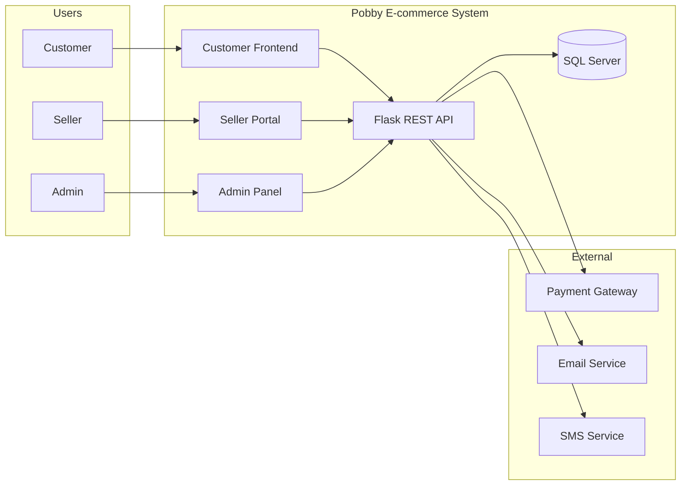

### 4.2.2 C4 Model - Level 2: Container Diagram

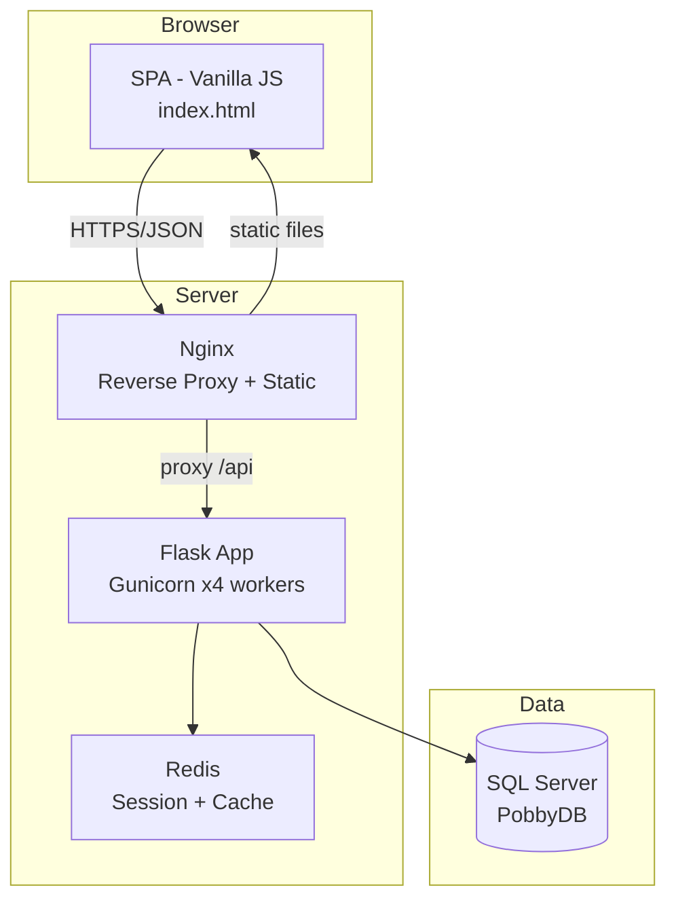

### 4.2.3 C4 Model - Level 3: Component Diagram (Flask App)

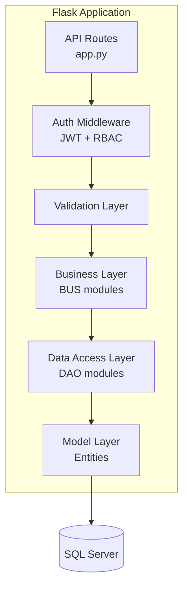

---

## 4.3 Thiết kế cơ sở dữ liệu (Database Design)

### 4.3.1 ERD (Entity Relationship Diagram)

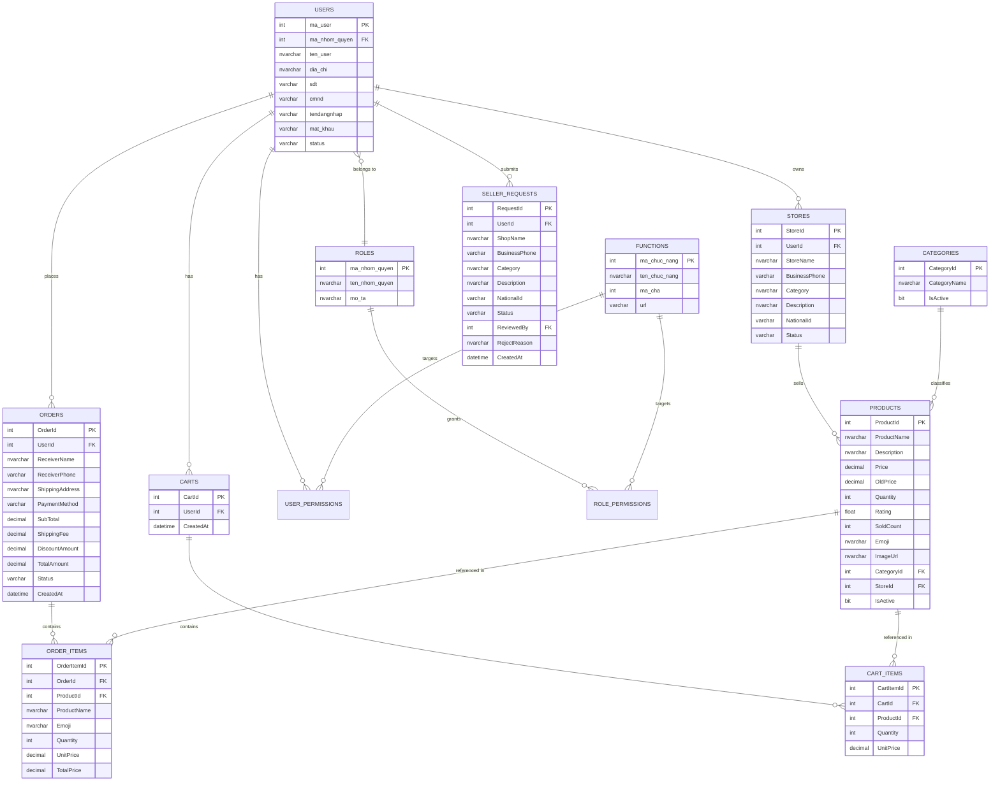

### 4.3.2 Bảng dữ liệu chi tiết (Table Schemas)

#### **Bảng: Users** (Người dùng)

| Trường | Kiểu dữ liệu | Ràng buộc | Mô tả |
|--------|--------------|-----------|-------|
| ma_user | INT | PK, IDENTITY(1,1) | Mã người dùng |
| ma_nhom_quyen | INT | FK → NhomQuyen, DEFAULT 2 | Nhóm quyền |
| ten_user | NVARCHAR(100) | NOT NULL | Tên người dùng |
| dia_chi | NVARCHAR(255) | NULL | Địa chỉ |
| sdt | VARCHAR(15) | NULL, UNIQUE | Số điện thoại |
| cmnd | VARCHAR(20) | NULL, UNIQUE | CMND/CCCD |
| tendangnhap | VARCHAR(50) | NOT NULL, UNIQUE | Tên đăng nhập |
| mat_khau | VARCHAR(255) | NOT NULL | Mật khẩu (bcrypt hash) |
| status | VARCHAR(20) | DEFAULT 'active' | active / blocked |

**Indexes:**
- `PK_Users` (ma_user) - Clustered
- `UQ_Users_tendangnhap` (tendangnhap) - Unique
- `UQ_Users_sdt` (sdt) - Unique
- `UQ_Users_cmnd` (cmnd) - Unique
- `IX_Users_ma_nhom_quyen` (ma_nhom_quyen) - Non-clustered

#### **Bảng: Products** (Sản phẩm)

| Trường | Kiểu dữ liệu | Ràng buộc | Mô tả |
|--------|--------------|-----------|-------|
| ProductId | INT | PK, IDENTITY(1,1) | Mã sản phẩm |
| ProductName | NVARCHAR(200) | NOT NULL | Tên sản phẩm |
| Description | NVARCHAR(MAX) | NULL | Mô tả |
| Price | DECIMAL(18,2) | NOT NULL, CHECK > 0 | Giá bán |
| OldPrice | DECIMAL(18,2) | NULL | Giá gốc |
| Quantity | INT | NOT NULL, DEFAULT 0, CHECK ≥ 0 | Số lượng tồn |
| Rating | FLOAT | DEFAULT 4.5, CHECK 0-5 | Đánh giá |
| SoldCount | INT | DEFAULT 0 | Đã bán |
| Emoji | NVARCHAR(10) | NULL | Biểu tượng |
| ImageUrl | NVARCHAR(500) | NULL | Ảnh |
| CategoryId | INT | FK → Categories | Danh mục |
| StoreId | INT | FK → Stores | Gian hàng |
| IsActive | BIT | DEFAULT 1 | Hiển thị |

**Indexes:**
- `PK_Products` (ProductId) - Clustered
- `IX_Products_CategoryId` (CategoryId) - Non-clustered
- `IX_Products_StoreId` (StoreId) - Non-clustered
- `IX_Products_ProductName` (ProductName) - Non-clustered (search)
- `IX_Products_Price` (Price) - Non-clustered (filter)

#### **Bảng: Orders** (Đơn hàng)

| Trường | Kiểu dữ liệu | Ràng buộc | Mô tả |
|--------|--------------|-----------|-------|
| OrderId | INT | PK, IDENTITY(1,1) | Mã đơn |
| UserId | INT | FK → Users | Người đặt |
| ReceiverName | NVARCHAR(100) | NOT NULL | Người nhận |
| ReceiverPhone | VARCHAR(15) | NOT NULL | SĐT |
| ShippingAddress | NVARCHAR(255) | NOT NULL | Địa chỉ |
| PaymentMethod | VARCHAR(20) | CHECK IN (COD, PayBank, PayInStore) | PT thanh toán |
| SubTotal | DECIMAL(18,2) | DEFAULT 0 | Tạm tính |
| ShippingFee | DECIMAL(18,2) | DEFAULT 25000 | Phí ship |
| DiscountAmount | DECIMAL(18,2) | DEFAULT 0 | Giảm giá |
| TotalAmount | DECIMAL(18,2) | DEFAULT 0 | Tổng tiền |
| Status | VARCHAR(20) | DEFAULT 'Pending' | Trạng thái |
| CreatedAt | DATETIME | DEFAULT GETDATE() | Ngày tạo |

**Indexes:**
- `PK_Orders` (OrderId) - Clustered
- `IX_Orders_UserId` (UserId) - Non-clustered
- `IX_Orders_Status` (Status) - Non-clustered
- `IX_Orders_CreatedAt` (CreatedAt) - Non-clustered (report)

#### **Bảng: Stores** (Gian hàng)

| Trường | Kiểu dữ liệu | Ràng buộc | Mô tả |
|--------|--------------|-----------|-------|
| StoreId | INT | PK, IDENTITY(1,1) | Mã gian hàng |
| UserId | INT | FK → Users, UNIQUE | Chủ shop |
| StoreName | NVARCHAR(100) | NOT NULL, UNIQUE | Tên shop |
| BusinessPhone | VARCHAR(15) | NOT NULL | SĐT kinh doanh |
| Category | NVARCHAR(100) | NOT NULL | Ngành hàng |
| Description | NVARCHAR(MAX) | NULL | Mô tả |
| NationalId | VARCHAR(20) | NOT NULL | CMND/CCCD |
| Status | VARCHAR(20) | DEFAULT 'Pending' | Pending/Approved/Rejected/Blocked |
| ReviewedBy | INT | FK → Users | Người duyệt |
| CreatedAt | DATETIME | DEFAULT GETDATE() | Ngày tạo |

#### **Bảng: Phân quyền (RBAC)**

| Bảng | Trường | Kiểu | Ràng buộc | Mô tả |
|------|--------|------|-----------|-------|
| **NhomQuyen** | ma_nhom_quyen | INT | PK | Mã nhóm quyền |
| | ten_nhom_quyen | NVARCHAR(50) | NOT NULL, UNIQUE | Tên nhóm |
| | mo_ta | NVARCHAR(255) | NULL | Mô tả |
| **ChucNang** | ma_chuc_nang | INT | PK | Mã chức năng |
| | ten_chuc_nang | NVARCHAR(100) | NOT NULL | Tên chức năng |
| | ma_cha | INT | NULL (self-FK) | Chức năng cha |
| | url | VARCHAR(100) | NULL | Đường dẫn |
| **PhanQuyen** | ma_phan_quyen | INT | PK | Mã phân quyền |
| | ma_nhom_quyen | INT | FK → NhomQuyen | Nhóm quyền |
| | ma_chuc_nang | INT | FK → ChucNang | Chức năng |
| | quyen_xem | BIT | DEFAULT 0 | Quyền xem |
| | quyen_them | BIT | DEFAULT 0 | Quyền thêm |
| | quyen_sua | BIT | DEFAULT 0 | Quyền sửa |
| | quyen_xoa | BIT | DEFAULT 0 | Quyền xóa |
| **UserPhanQuyen** | ma_user | INT | FK → Users | User |
| | ma_chuc_nang | INT | FK → ChucNang | Chức năng |
| | quyen_ngoai_le | NVARCHAR(50) | NULL | Quyền ngoại lệ |

### 4.3.3 Stored Procedures (Thủ tục lưu trữ)

| Tên | Mô tả | Tham số |
|-----|-------|---------|
| `sp_ThongKeTongQuan` | Thống kê KPI dashboard | - |
| `sp_DoanhThuTheoThang` | Doanh thu theo tháng | @Year INT |
| `sp_LaySanPhamBanChay` | Top sản phẩm bán chạy | @Top INT |
| `sp_LayDonHangCuaUser` | Đơn hàng của user | @UserId INT |
| `sp_LayDonHangCuaSeller` | Đơn hàng của seller | @StoreId INT |
| `sp_TaoDonHang` | Tạo đơn hàng (transaction) | @UserId, @Items, ... |
| `sp_CapNhatTrangThaiDon` | Cập nhật trạng thái đơn | @OrderId, @Status |
| `sp_LayQuyenCuaUser` | Quyền của user | @MaUser INT |
| `sp_CapQuyenNgoaiLe` | Phân quyền ngoại lệ | @MaUser, @Permissions |

---

*Đang tiếp tục Batch 2/3: API Design, Security Architecture & Deployment...*

---

## 4.4 Thiết kế API (API Design)

### 4.4.1 REST API Conventions

| Quy ước | Chi tiết |
|---------|----------|
| **Base URL** | `/api` |
| **Format** | JSON (application/json) |
| **Auth** | Bearer Token (JWT) trong header `Authorization` |
| **Naming** | Kebab-case: `/api/don-hang/tat-ca` |
| **HTTP Methods** | GET (read), POST (create), PUT (update), DELETE (delete) |
| **Status Codes** | 200 OK, 201 Created, 400 Bad Request, 401 Unauthorized, 403 Forbidden, 404 Not Found, 500 Server Error |
| **Response Format** | `{"status": true/false, "message": "...", "data": {...}}` |
| **Pagination** | `?page=1&page_size=10` → `{"data": [...], "total": 100, "page": 1}` |
| **Filtering** | `?category_id=1&min_price=100000&max_price=500000` |
| **Sorting** | `?sort_by=price&order=asc` |
| **Search** | `?q=keyword` |

### 4.4.2 Danh sách Endpoints (API Endpoints)

#### **A. Authentication & User**

| Method | Endpoint | Mô tả | Auth | Body/Params |
|--------|----------|-------|------|-------------|
| POST | `/api/dang-ky` | Đăng ký tài khoản | Public | ten_user, dia_chi, sdt, tendangnhap, mat_khau |
| POST | `/api/dang-nhap` | Đăng nhập | Public | tendangnhap, mat_khau |
| GET | `/api/users` | Danh sách user | Admin | - |
| POST | `/api/cap-nhat-profile` | Cập nhật hồ sơ | User | ma_user, ten_user, dia_chi, sdt, cmnd |
| POST | `/api/doi-mat-khau` | Đổi mật khẩu | User | ma_user, mat_khau_cu, mat_khau_moi |
| PUT | `/api/users/{ma_user}/role` | Phân vai trò | Admin | role_id |
| PUT | `/api/users/{ma_user}/status` | Khóa/mở khóa | Admin | status |

#### **B. Phân quyền (RBAC)**

| Method | Endpoint | Mô tả | Auth |
|--------|----------|-------|------|
| POST | `/api/cap-quyen-ngoai-le` | Phân quyền ngoại lệ cho user | Super Admin |
| POST | `/api/cap-quyen-nhom` | Cập nhật quyền nhóm | Super Admin |
| GET | `/api/quyen-cua-user/{ma_user}` | Quyền của user | Admin |
| GET | `/api/quyen-cua-nhom/{ma_nhom}` | Quyền của nhóm | Admin |
| POST | `/api/ap-dung-quyen-nhom-cho-user` | Áp dụng quyền nhóm cho user | Super Admin |
| GET | `/api/roles` | Danh sách nhóm quyền | Admin |
| POST | `/api/roles` | Thêm nhóm quyền | Super Admin |
| PUT | `/api/roles/{role_id}` | Sửa nhóm quyền | Super Admin |
| DELETE | `/api/roles/{role_id}` | Xóa nhóm quyền | Super Admin |

#### **C. Gian hàng (Seller)**

| Method | Endpoint | Mô tả | Auth |
|--------|----------|-------|------|
| POST | `/api/dang-ky-gian-hang` | Đăng ký gian hàng | User |
| GET | `/api/seller-requests` | Danh sách yêu cầu | Admin |
| POST | `/api/duyet-seller/{request_id}` | Duyệt yêu cầu | Admin |
| POST | `/api/tu-choi-seller/{request_id}` | Từ chối yêu cầu | Admin |
| GET | `/api/stores/by-user/{user_id}` | Gian hàng của user | User |

#### **D. Danh mục (Categories)**

| Method | Endpoint | Mô tả | Auth |
|--------|----------|-------|------|
| GET | `/api/categories` | Danh sách danh mục | Public |
| POST | `/api/categories` | Thêm danh mục | Admin |
| PUT | `/api/categories/{category_id}` | Sửa danh mục | Admin |
| DELETE | `/api/categories/{category_id}` | Xóa danh mục | Admin |

#### **E. Sản phẩm (Products)**

| Method | Endpoint | Mô tả | Auth |
|--------|----------|-------|------|
| GET | `/api/products` | Danh sách SP (filter, search, pagination) | Public |
| GET | `/api/products/best-sellers` | Top SP bán chạy | Public |
| GET | `/api/products/store/{store_id}` | SP của gian hàng | Public |
| GET | `/api/products/{product_id}` | Chi tiết SP | Public |
| POST | `/api/products` | Thêm SP | Seller/Admin |
| PUT | `/api/products/{product_id}` | Sửa SP | Seller/Admin |
| DELETE | `/api/products/{product_id}` | Xóa SP | Seller/Admin |

#### **F. Giỏ hàng (Cart)**

| Method | Endpoint | Mô tả | Auth |
|--------|----------|-------|------|
| POST | `/api/gio-hang/them` | Thêm vào giỏ | User |
| POST | `/api/gio-hang/xoa` | Xóa khỏi giỏ | User |
| POST | `/api/gio-hang/cap-nhat` | Cập nhật số lượng | User |
| POST | `/api/gio-hang/xoa-tat-ca` | Xóa toàn bộ giỏ | User |
| GET | `/api/gio-hang/{user_id}` | Xem giỏ hàng | User |

#### **G. Đơn hàng (Orders)**

| Method | Endpoint | Mô tả | Auth |
|--------|----------|-------|------|
| POST | `/api/don-hang/dat-hang` | Tạo đơn hàng | User |
| GET | `/api/don-hang/tat-ca` | Tất cả đơn hàng | Admin |
| GET | `/api/don-hang/cua-toi/{user_id}` | Đơn của user | User |
| GET | `/api/don-hang/cua-seller/{store_id}` | Đơn của seller | Seller |
| PUT | `/api/don-hang/{order_id}/trang-thai` | Cập nhật trạng thái | Seller/Admin |

#### **H. Thống kê (Statistics)**

| Method | Endpoint | Mô tả | Auth |
|--------|----------|-------|------|
| GET | `/api/thong-ke/tong-quan` | KPI dashboard | Admin |
| GET | `/api/thong-ke/doanh-thu-theo-thang?year=2026` | Doanh thu theo tháng | Admin |

### 4.4.3 Ví dụ Request/Response

#### **POST /api/dang-nhap**

```json
// Request
{
  "tendangnhap": "admin",
  "mat_khau": "admin123"
}

// Response 200 OK
{
  "status": true,
  "message": "Đăng nhập thành công",
  "data": {
    "ma_user": 1,
    "ten_user": "Quản trị viên",
    "tendangnhap": "admin",
    "ma_nhom_quyen": 4,
    "token": "eyJhbGciOiJIUzI1NiIsInR5cCI6IkpXVCJ9..."
  }
}

// Response 401 Unauthorized
{
  "status": false,
  "message": "Tên đăng nhập hoặc mật khẩu không đúng"
}
```

#### **POST /api/don-hang/dat-hang**

```json
// Request
{
  "UserId": 5,
  "ReceiverName": "Nguyễn Văn A",
  "ReceiverPhone": "0901234567",
  "ShippingAddress": "123 Lê Lợi, Q1, TP.HCM",
  "PaymentMethod": "COD",
  "SubTotal": 1500000,
  "ShippingFee": 25000,
  "Discount": 0,
  "TotalAmount": 1525000,
  "Items": [
    {
      "ProductId": 1,
      "ProductName": "G-SHOCK GA-2100",
      "Emoji": "⌚",
      "Quantity": 1,
      "UnitPrice": 1500000
    }
  ]
}

// Response 201 Created
{
  "status": true,
  "message": "Đặt hàng thành công",
  "data": {
    "OrderId": 1001,
    "TotalAmount": 1525000,
    "Status": "Pending"
  }
}
```

### 4.4.4 Error Handling Convention

| Error Code | HTTP Status | Mô tả | Ví dụ |
|------------|-------------|-------|-------|
| `VALIDATION_ERROR` | 400 | Dữ liệu không hợp lệ | Email sai format |
| `UNAUTHORIZED` | 401 | Chưa đăng nhập / token hết hạn | Token expired |
| `FORBIDDEN` | 403 | Không có quyền truy cập | User không phải admin |
| `NOT_FOUND` | 404 | Tài nguyên không tồn tại | Product ID sai |
| `CONFLICT` | 409 | Xung đột dữ liệu | Tên đăng nhập trùng |
| `RATE_LIMITED` | 429 | Vượt quá giới hạn request | Quá 100 req/phút |
| `INTERNAL_ERROR` | 500 | Lỗi server | Exception không xử lý |

```json
// Error Response Format
{
  "status": false,
  "error": {
    "code": "VALIDATION_ERROR",
    "message": "Dữ liệu không hợp lệ",
    "details": {
      "email": "Email không đúng định dạng",
      "password": "Mật khẩu phải ≥ 6 ký tự"
    }
  }
}
```

---

## 4.5 Kiến trúc Bảo mật (Security Architecture)

### 4.5.1 Authentication Flow (JWT)

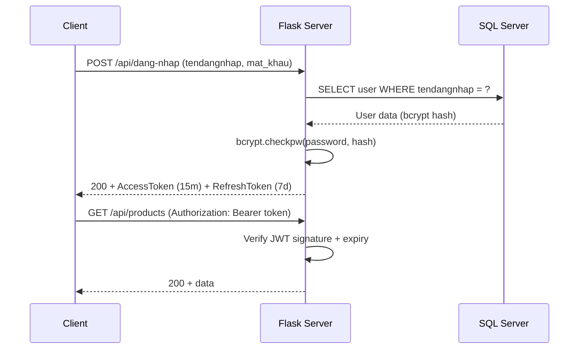

### 4.5.2 Authorization Flow (RBAC)

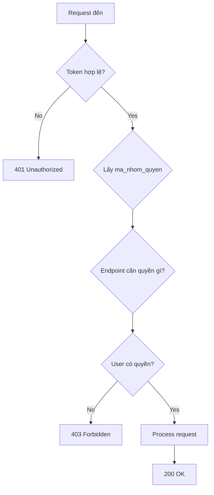

### 4.5.3 Security Headers

| Header | Giá trị | Mô tả |
|--------|---------|-------|
| `Content-Security-Policy` | `default-src 'self'; script-src 'self' cdn.jsdelivr.net cdnjs.cloudflare.com` | Chống XSS |
| `X-Frame-Options` | `DENY` | Chống clickjacking |
| `X-Content-Type-Options` | `nosniff` | Chống MIME sniffing |
| `Strict-Transport-Security` | `max-age=31536000; includeSubDomains` | Ép HTTPS |
| `Referrer-Policy` | `strict-origin-when-cross-origin` | Bảo vệ referrer |
| `Permissions-Policy` | `camera=(), microphone=(), geolocation=()` | Giới hạn API browser |
| `Cache-Control` | `no-store` (cho API auth) | Chống cache dữ liệu nhạy cảm |

### 4.5.4 Input Validation & Sanitization

| Loại | Kỹ thuật | Ví dụ |
|------|----------|-------|
| **SQL Injection** | Parameterized queries (pyodbc `?` placeholder) | `SELECT * FROM Users WHERE tendangnhap = ?` |
| **XSS** | Escape output, không dùng innerHTML với user input | `html.escape(user_input)` |
| **Command Injection** | Không dùng `os.system`/`subprocess` với user input | - |
| **Path Traversal** | Validate filename, không dùng user input làm path | `os.path.basename(filename)` |
| **File Upload** | Validate MIME, extension, size ≤ 2MB | `allowed_extensions = {jpg, png, webp}` |
| **Email** | Regex validation | `^[a-zA-Z0-9._%+-]+@[a-zA-Z0-9.-]+\.[a-zA-Z]{2,}$` |
| **Phone** | Regex validation VN | `^0[0-9]{9,10}$` |
| **Password** | ≥ 8 ký tự, 1 hoa, 1 thường, 1 số | `^(?=.*[a-z])(?=.*[A-Z])(?=.*\d).{8,}$` |

### 4.5.5 Secrets Management

| Secret | Nơi lưu trữ | Không được lưu ở |
|--------|-------------|------------------|
| DB connection string | Environment variable / .env (gitignored) | Code, Git history |
| JWT secret key | Environment variable | Code |
| Payment API keys | Environment variable / Vault | Code |
| SMTP credentials | Environment variable | Code |
| Admin default password | Force change on first login | Hardcoded |

---

## 4.6 Kiến trúc Triển khai (Deployment Architecture)

### 4.6.1 Môi trường (Environments)

| Môi trường | URL | Mục đích | Dữ liệu |
|------------|-----|----------|---------|
| **Development** | `localhost:5000` | Dev local | Dev DB (seed) |
| **Staging** | `staging.pobby.vn` | Test, UAT | Staging DB (seed + test) |
| **Production** | `pobby.vn` | Production | Production DB |

### 4.6.2 Docker Deployment

```dockerfile
# Dockerfile
FROM python:3.12-slim

WORKDIR /app

COPY requirements.txt .
RUN pip install --no-cache-dir -r requirements.txt

COPY . .

EXPOSE 5000

CMD ["gunicorn", "--bind", "0.0.0.0:5000", "--workers", "4", "app:app"]
```

```yaml
# docker-compose.yml
version: '3.8'

services:
  web:
    build: .
    ports:
      - "5000:5000"
    environment:
      - DB_CONNECTION_STRING=${DB_CONNECTION_STRING}
      - JWT_SECRET_KEY=${JWT_SECRET_KEY}
    depends_on:
      - db
    restart: unless-stopped

  db:
    image: mcr.microsoft.com/mssql/server:2022-latest
    environment:
      - ACCEPT_EULA=Y
      - SA_PASSWORD=${SA_PASSWORD}
    volumes:
      - mssql_data:/var/opt/mssql
    ports:
      - "1433:1433"
    restart: unless-stopped

  nginx:
    image: nginx:alpine
    ports:
      - "80:80"
      - "443:443"
    volumes:
      - ./nginx.conf:/etc/nginx/nginx.conf
      - ./static:/usr/share/nginx/html/static
    depends_on:
      - web
    restart: unless-stopped

volumes:
  mssql_data:
```

### 4.6.3 CI/CD Pipeline (GitHub Actions)

```yaml
# .github/workflows/ci-cd.yml
name: CI/CD Pipeline

on:
  push:
    branches: [main, develop]
  pull_request:
    branches: [main]

jobs:
  test:
    runs-on: ubuntu-latest
    steps:
      - uses: actions/checkout@v4
      - uses: actions/setup-python@v5
        with:
          python-version: '3.12'
      - run: pip install -r requirements.txt
      - run: pip install pytest pytest-cov
      - run: pytest --cov=back_end --cov-report=xml
      - uses: codecov/codecov-action@v4

  build:
    needs: test
    runs-on: ubuntu-latest
    steps:
      - uses: actions/checkout@v4
      - name: Build Docker image
        run: docker build -t pobby:${{ github.sha }} .
      - name: Push to registry
        run: |
          echo ${{ secrets.DOCKER_PASSWORD }} | docker login -u ${{ secrets.DOCKER_USERNAME }} --password-stdin
          docker push pobby:${{ github.sha }}

  deploy:
    needs: build
    if: github.ref == 'refs/heads/main'
    runs-on: ubuntu-latest
    steps:
      - name: Deploy to production
        run: |
          ssh user@server "docker pull pobby:${{ github.sha }} && docker-compose up -d"
```

### 4.6.4 Nginx Configuration

```nginx
server {
    listen 80;
    server_name pobby.vn;
    return 301 https://$host$request_uri;
}

server {
    listen 443 ssl;
    server_name pobby.vn;

    ssl_certificate     /etc/ssl/pobby.vn.crt;
    ssl_certificate_key /etc/ssl/pobby.vn.key;

    # Static files
    location /static/ {
        alias /usr/share/nginx/html/static/;
        expires 30d;
        add_header Cache-Control "public, immutable";
    }

    # API proxy
    location /api/ {
        proxy_pass http://web:5000;
        proxy_set_header Host $host;
        proxy_set_header X-Real-IP $remote_addr;
        proxy_set_header X-Forwarded-For $proxy_add_x_forwarded_for;
        proxy_set_header X-Forwarded-Proto $scheme;
    }

    # SPA
    location / {
        proxy_pass http://web:5000;
        proxy_set_header Host $host;
    }
}
```

---

*Đang tiếp tục Batch 3/3: Integration Points, Testing Strategy & Monitoring...*

---

## 4.7 Tích hợp API & Bên thứ ba (API Integrations)

### 4.7.1 Bảng tích hợp

| Dịch vụ | Loại | Mô tả | Trạng thái | Giai đoạn |
|---------|------|-------|------------|-----------|
| **SweetAlert2** | UI Library | Thông báo/confirm dialog | ✅ Đã tích hợp | Phase 1 |
| **Font Awesome** | Icon Library | Biểu tượng giao diện | ✅ Đã tích hợp | Phase 1 |
| **Momo Payment** | Payment Gateway | Thanh toán ví điện tử | ❌ Chưa tích hợp | Phase 1 (Sprint 5) |
| **VNPay** | Payment Gateway | Thanh toán ngân hàng | ❌ Chưa tích hợp | Phase 1 (Sprint 5) |
| **Stripe** | Payment Gateway | Thanh toán quốc tế | ❌ Chưa tích hợp | Phase 3 |
| **SMS Gateway** | Notification | Gửi SMS OTP | ❌ Chưa tích hợp | Phase 2 |
| **Email Service** | Notification | Gửi email xác nhận | ❌ Chưa tích hợp | Phase 2 |
| **Google Analytics** | Analytics | Theo dõi hành vi user | ❌ Chưa tích hợp | Phase 1 |
| **Cloudflare** | CDN/WAF | CDN, DDoS protection | ❌ Chưa tích hợp | Phase 1 |
| **GHN/GHTK** | Logistics | Tạo đơn vận chuyển | ❌ Chưa tích hợp | Phase 2 |

### 4.7.2 Payment Gateway Integration Design

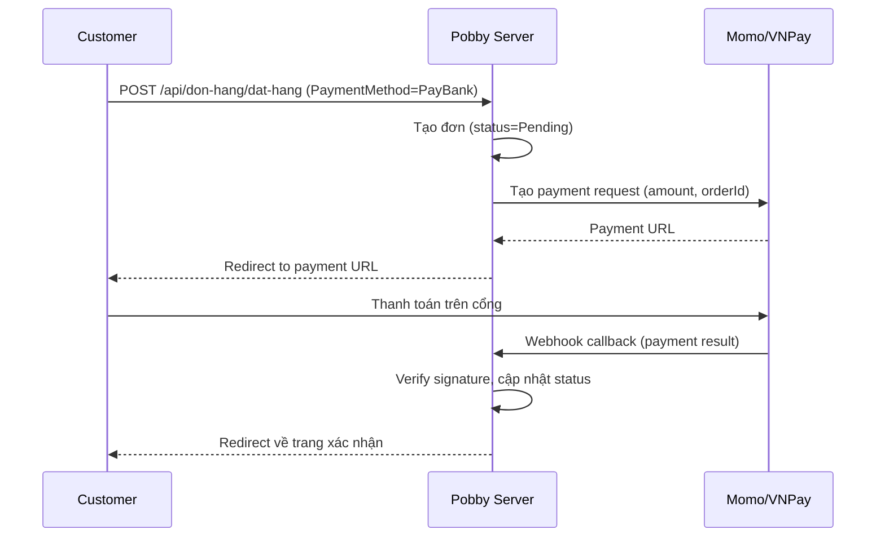

### 4.7.3 Webhook Security

| Yêu cầu | Mô tả |
|---------|-------|
| **Signature verification** | Xác minh chữ ký HMAC từ payment gateway |
| **Idempotency** | Xử lý webhook trùng lặp (dùng orderId + transactionId) |
| **Timeout** | Webhook handler < 5s, retry queue nếu lỗi |
| **IP whitelist** | Chỉ chấp nhận webhook từ IP của gateway |
| **Logging** | Ghi log toàn bộ webhook request/response |

---

## 4.8 Tiêu chuẩn Phát triển (Development Standards)

### 4.8.1 Coding Standards

| Hạng mục | Tiêu chuẩn |
|----------|-----------|
| **Python** | PEP 8, type hints, docstrings |
| **Naming** | snake_case (Python), camelCase (JS), PascalCase (SQL tables) |
| **SQL** | Uppercase keywords, parameterized queries, stored proc cho logic phức tạp |
| **JS** | ES6+, const/let (không var), arrow functions, template literals |
| **CSS** | BEM naming convention, CSS variables cho theme |
| **Error handling** | try/except cụ thể, không bare except, log đầy đủ |
| **Security** | Không hardcode secret, validate input, escape output |

### 4.8.2 Git Flow

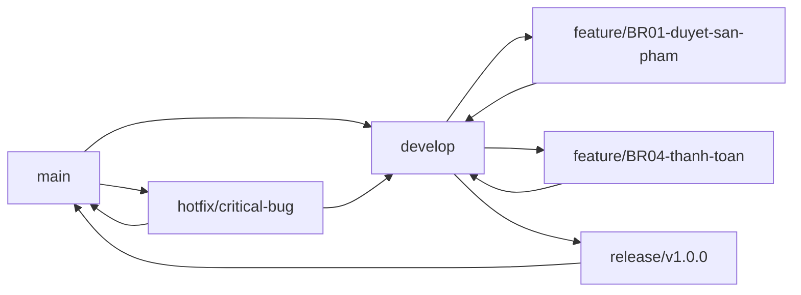

| Branch | Mục đích | Merge vào |
|--------|----------|-----------|
| `main` | Production code | - |
| `develop` | Integration branch | main (qua release) |
| `feature/*` | Feature development | develop |
| `release/*` | Release preparation | main + develop |
| `hotfix/*` | Critical bug fix | main + develop |

### 4.8.3 Code Review Checklist

| # | Checklist |
|---|-----------|
| 1 | Code đúng yêu cầu (FR/BR mapping) |
| 2 | Không có secret/credential trong code |
| 3 | Input validation đầy đủ |
| 4 | Parameterized queries (không SQL injection) |
| 5 | Error handling đúng, không nuốt lỗi |
| 6 | Naming convention nhất quán |
| 7 | Không code trùng lặp (DRY) |
| 8 | Performance: không N+1 query, có index |
| 9 | Test cases được thêm cho logic mới |
| 10 | Documentation cập nhật (nếu cần) |

---

## 4.9 Chiến lược Kiểm thử (Testing Strategy)

### 4.9.1 Test Pyramid

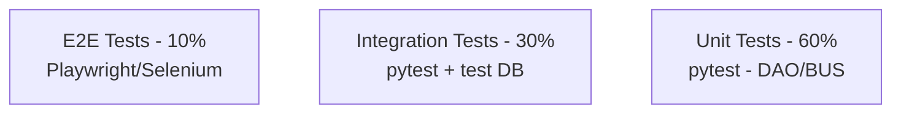

### 4.9.2 Các loại kiểm thử

| Loại | Công cụ | Phạm vi | Mục tiêu coverage |
|------|---------|---------|-------------------|
| **Unit Test** | pytest | DAO, BUS, Model | ≥ 80% |
| **Integration Test** | pytest + test DB | API endpoints, DB interaction | ≥ 70% |
| **E2E Test** | Playwright | Customer journey, Admin flow | Critical paths |
| **API Test** | Postman/Newman | Toàn bộ endpoints | 100% endpoints |
| **Performance Test** | Locust/k6 | Load, stress, soak | 10k VU |
| **Security Test** | OWASP ZAP, Bandit | Vulnerability scan | 0 critical |
| **Accessibility Test** | axe-core | WCAG 2.1 AA | All pages |
| **Cross-browser Test** | Playwright | Chrome, Firefox, Safari, Edge | All pages |

### 4.9.3 Test Cases mẫu (Sample Test Cases)

| ID | Module | Test Case | Steps | Expected Result | Priority |
|----|--------|-----------|-------|-----------------|----------|
| **TC-001** | Đăng nhập | Đăng nhập thành công | Nhập đúng tendangnhap + mat_khau → Submit | 200, token trả về, redirect dashboard | High |
| **TC-002** | Đăng nhập | Đăng nhập sai mật khẩu | Nhập sai mat_khau → Submit | 401, message "Sai mật khẩu" | High |
| **TC-003** | Đăng nhập | Khóa tài khoản sau 5 lần sai | Nhập sai 5 lần | Tài khoản bị khóa 15 phút | High |
| **TC-004** | Sản phẩm | Tìm kiếm SP theo tên | Nhập "G-SHOCK" → Search | Hiển thị SP chứa "G-SHOCK" | High |
| **TC-005** | Sản phẩm | Lọc theo khoảng giá | Chọn 1tr-3tr → Apply | Chỉ hiển thị SP trong khoảng | Medium |
| **TC-006** | Giỏ hàng | Thêm SP vào giỏ | Chọn SP → Add to cart | Badge tăng, cart hiển thị SP | High |
| **TC-007** | Giỏ hàng | Thêm SP vượt tồn kho | Nhập SL > tồn kho | Thông báo lỗi, không thêm | High |
| **TC-008** | Thanh toán | Tạo đơn COD thành công | Điền form → Confirm | Đơn tạo, tồn kho giảm, giỏ trống | High |
| **TC-009** | Thanh toán | Validation SĐT sai | Nhập SĐT 5 số | Lỗi "SĐT không hợp lệ" | Medium |
| **TC-010** | Đơn hàng | Hủy đơn chờ xác nhận | Chọn đơn Pending → Hủy | Status = Cancelled, hoàn tồn kho | High |
| **TC-011** | Seller | Đăng ký gian hàng | Điền form → Submit | Yêu cầu Pending, chờ Admin duyệt | High |
| **TC-012** | Admin | Duyệt Seller | Chọn yêu cầu → Approve | Store active, user có quyền Seller | High |
| **TC-013** | Admin | Dashboard KPI | Vào Dashboard | 4 KPI hiển thị đúng | High |
| **TC-014** | Phân quyền | User không có quyền truy cập admin | User thường gọi API admin | 403 Forbidden | High |
| **TC-015** | Bảo mật | SQL Injection test | Nhập `' OR 1=1 --` vào search | Không trả về toàn bộ data | High |

### 4.9.4 Test Data Strategy

| Loại dữ liệu | Nguồn | Mục đích |
|--------------|-------|----------|
| **Seed data** | database.sql | Dữ liệu mẫu: 5 categories, 20+ products, 4 roles |
| **Test fixtures** | pytest fixtures | Dữ liệu test độc lập cho từng test |
| **Factory data** | Factory Boy | Tạo dữ liệu động cho integration test |
| **Production-like data** | Script tạo 10k users, 100k products | Performance test |

---

## 4.10 Giám sát & Bảo trì (Monitoring & Maintenance)

### 4.10.1 Monitoring Stack

| Thành phần | Công cụ | Mô tả |
|------------|---------|-------|
| **Metrics** | Prometheus | Thu thập metrics: CPU, memory, request, latency |
| **Dashboard** | Grafana | Dashboard trực quan, alert rules |
| **Logging** | ELK Stack / Loki | Centralized log, search, correlation |
| **Tracing** | OpenTelemetry + Jaeger | Distributed tracing |
| **APM** | NewRelic/Datadog | Application performance monitoring |
| **Uptime** | UptimeRobot | External uptime check |
| **Error tracking** | Sentry | Exception tracking, source map |

### 4.10.2 Metrics cần theo dõi

| Nhóm | Metric | Threshold | Alert |
|------|--------|-----------|-------|
| **Infrastructure** | CPU utilization | > 70% trong 5 phút | Warning |
| | Memory utilization | > 80% | Critical |
| | Disk usage | > 85% | Critical |
| | Network I/O | > 70% | Warning |
| **Application** | Request latency P95 | > 500ms | Warning |
| | Error rate (5xx) | > 1% | Critical |
| | Active users | Giảm đột biến > 50% | Warning |
| | Order success rate | < 95% | Critical |
| **Database** | Connection pool | > 70% | Warning |
| | Slow queries | > 100ms | Warning |
| | Deadlocks | > 0 | Critical |
| | Backup success | Fail | Critical |
| **Business** | GMV/ngày | Giảm > 30% | Warning |
| | Conversion rate | < 1% | Warning |
| | Cart abandonment | > 80% | Info |

### 4.10.3 Alerting & Incident Response

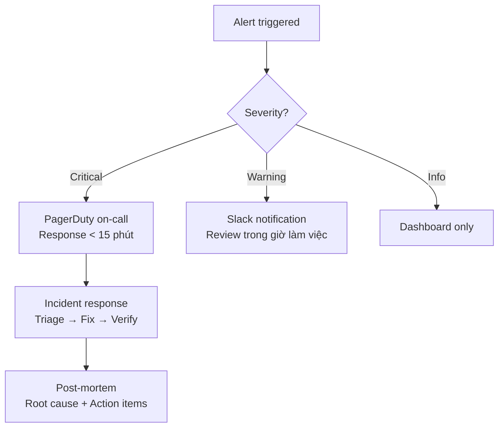

### 4.10.4 Bảo trì định kỳ (Maintenance Schedule)

| Hoạt động | Tần suất | Thời gian | Owner |
|-----------|----------|-----------|-------|
| **Backup verification** | Hàng ngày | 15 phút | DBA |
| **Security patch** | Hàng tuần | 1 giờ | DevOps |
| **Dependency update** | Hàng tuần | 2 giờ | Backend |
| **Performance review** | Hàng tuần | 1 giờ | Backend/DevOps |
| **Log review** | Hàng tuần | 1 giờ | DevOps |
| **Restore test** | Hàng tháng | 2 giờ | DBA |
| **Pen-test** | Hàng quý | 1 ngày | Security |
| **Load test** | Hàng quý | 1 ngày | QA |
| **Disaster recovery drill** | Hàng quý | 1 ngày | DevOps/DBA |
| **Code review** | Mỗi PR | 30 phút | Team |

---

## 4.11 Tổng kết & Phụ lục (Summary & Appendix)

### 4.11.1 Traceability Matrix (Ma trận truy vết)

| BR# | FR# | NFR# | Module | Test Case | Trạng thái |
|-----|-----|------|--------|-----------|------------|
| BR01 | FR-01, FR-02 | NFR-P02 | Duyệt sản phẩm | TC-004, TC-005 | 🟡 |
| BR02 | FR-03 | NFR-P02 | Chi tiết SP | TC-004 | 🟡 |
| BR03 | FR-04, FR-05 | NFR-P05 | Giỏ hàng | TC-006, TC-007 | 🟡 |
| BR04 | FR-06 | NFR-P06 | Thanh toán | TC-008, TC-009 | 🟡 |
| BR05 | FR-07, FR-08 | NFR-P06 | Theo dõi đơn | TC-010 | 🟡 |
| BR06 | FR-09 | NFR-S01 | Đăng ký | TC-001 | 🟡 |
| BR07 | FR-10 | NFR-S02 | Đăng nhập | TC-001, TC-002, TC-003 | 🟡 |
| BR13 | FR-16 | NFR-S03 | Đăng ký gian hàng | TC-011 | 🟡 |
| BR20 | FR-23 | NFR-P08 | Dashboard | TC-013 | 🟡 |
| BR22 | FR-17 | NFR-S03 | Duyệt Seller | TC-012 | 🟡 |
| BR30 | FR-32 | NFR-S03 | Phân quyền | TC-014 | 🟡 |

### 4.11.2 Glossary (Thuật ngữ)

| Thuật ngữ | Định nghĩa |
|-----------|-----------|
| **B2B2C** | Business-to-Business-to-Consumer - mô hình marketplace |
| **GMV** | Gross Merchandise Value - tổng giá trị hàng hóa |
| **KYC** | Know Your Customer - xác minh danh tính |
| **RBAC** | Role-Based Access Control - phân quyền theo vai trò |
| **JWT** | JSON Web Token - token xác thực |
| **SPA** | Single Page Application - ứng dụng một trang |
| **SLA** | Service Level Agreement - thỏa thuận mức dịch vụ |
| **RPO** | Recovery Point Objective - mục tiêu điểm khôi phục |
| **RTO** | Recovery Time Objective - mục tiêu thời gian khôi phục |
| **MTTR** | Mean Time To Repair - thời gian sửa chữa trung bình |
| **Take Rate** | Tỷ lệ hoa hồng nền tảng thu từ seller |
| **Payout** | Quá trình rút tiền của seller |

### 4.11.3 Danh sách tài liệu tham chiếu

| Tài liệu | Mô tả |
|----------|-------|
| `report.md` | Báo cáo mô tả hệ thống gốc (System Requirement & Design Specification) |
| `BRD_TRD_REPORT_PLAN.md` | Kế hoạch viết báo cáo BRD/TRD |
| `app.py` | Flask application - REST API routes |
| `back_end/` | Model, DAO, BUS layers |
| `Database/database.sql` | Database schema & seed data |
| `requirements.txt` | Python dependencies |

---

## ✅ HOÀN THÀNH BÁO CÁO BRD & TRD

**Tóm tắt nội dung đã hoàn thành:**

| Phần | Nội dung | Số lần ghi |
|------|----------|-----------|
| **Phần 1: BRD** | Executive Summary, Objectives, Scope, Stakeholders, SWOT, Financial, Process Flows, Business Rules | 3 lần |
| **Phần 2: SRS** | Roles & Matrix, Customer/Seller/Admin Modules, FR List, Use Cases, Data Dictionary | 3 lần |
| **Phần 3: NFR** | Performance, Security, Scalability, Usability, Reliability, Compliance, Transition | 3 lần |
| **Phần 4: TRD** | Tech Stack, Architecture, Database, API, Security, Deployment, Integration, Testing, Monitoring | 3 lần |

**Tổng cộng: 12 lần ghi dữ liệu (4 phần × 3 batch mỗi phần)**