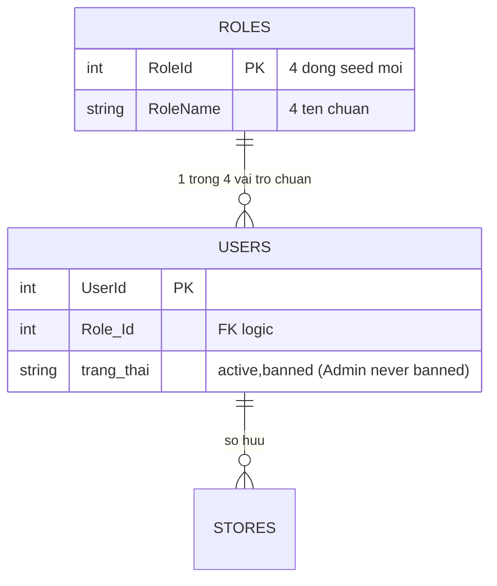

# Data Model: 001-role-refactor

**Ngày**: 2026-09-17 | **Nguồn**: [spec.md](./spec.md), [research.md](./research.md)

## Entity 1: Role (Vai trò)

| Thuộc tính | Kiểu SQL | Ràng buộc | Ghi chú |
|---|---|---|---|
| `RoleId` | INT IDENTITY PK | Chỉ tồn tại 4 dòng chuẩn | ID do seed mới quyết định (không giữ 13/14/19/20 cố định) |
| `RoleName` | NVARCHAR(100) NOT NULL | UNIQUE, ∈ {4 tên chuẩn chốt trong seed mới} | Tên chuẩn chốt trong seed; hiển thị tiếng Việt ở BUS/UI |

**Validation**: Không còn API roles (FR-005 sau clarify) — không có validate runtime; tính bất biến đảm bảo bởi seed + không tồn tại endpoint tạo/sửa/xóa/gán vai trò.
**State**: bất biến — 4 dòng chuẩn chỉ tạo bởi seed.
**Quan hệ**: 1 Role ↔ N User qua `Users.Role_Id` (không FK vật lý, đảm bảo bởi seed + không có API đổi vai trò).

## Entity 2: User (Người dùng)

| Thuộc tính | Kiểu SQL | Ràng buộc | Ghi chú |
|---|---|---|---|
| `UserId` | INT IDENTITY PK | — | Script chạy theo `UserId`, không theo tên |
| `FullName`, `Address`, `Phone`, `NationalId`, `Username`, `Password` | hiện có | giữ nguyên | Plaintext password là nợ đã ghi nhận, ngoài phạm vi spec này |
| `Role_Id` | INT NULL | Sau rebuild seed: NOT NULL logic, trỏ 1 trong 4 vai trò chuẩn | Seed mới không chứa NULL/lạ; runtime gặp NULL/lạ → từ chối đăng nhập rõ ràng, không crash |
| `trang_thai` | NVARCHAR(20) NULL → 'active' | ∈ {'active','banned'}; Admin không bao giờ 'banned' | `back_up.sql` đã có; `database.sql` thiếu → script tự thêm cột nếu thiếu + guard chống khóa Admin |

**Quy tắc seed mới**: `UserId=1 → Admin`; chủ `Stores` → Seller; còn lại → Customer. Seller giữ vai trò dù `Stores.IsActive=0`. Seed tự chứa `Users` + `Stores` nhất quán.
**Đăng nhập**: `UserDao.dang_nhap` JOIN `Roles` trả `ma_nhom_quyen + ten_vai_tro`; banned (non-admin) → từ chối (giữ hành vi cũ); Admin bị khóa → bị chặn từ `cap_nhat_trang_thai` nên không xảy ra.

## Entity 3: Store (Gian hàng) — chỉ đọc

| Thuộc tính | Kiểu | Dùng trong spec này |
|---|---|---|
| `StoreId` PK, `UserId` FK logic → Users, `IsActive` BIT | hiện có | `SELECT DISTINCT UserId FROM Stores` làm căn cứ Seller |

## Entity bị xóa: Permission / Module (+ toàn bộ quản lý roles)

- `Permissions(UserId, ModuleId, CanView/CanAdd/CanEdit/CanDelete, IsCustom)` và `Modules(ModuleId, ModuleName, ModuleCode, ...)` bị DROP (sau khi xóa code tham chiếu). Xóa file `Model/PhanQuyen.py`, `BUS/PhanQuyenBus.py`, `DAO/PhanQuyenDao.py`.
- `PhanQuyenDao.xoa_role` từng DELETE `RolePermissions` (bảng không tồn tại) — xóa cùng toàn bộ file.

## Sơ đồ quan hệ (sau chuẩn hóa)

